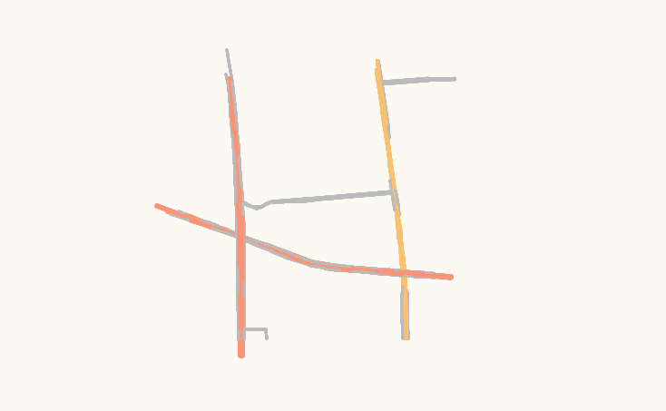

**geohashtile在使用时遇到了如下问题：**

​	不论是离线地图数据还是从区块链拉取的地图数据，其展示速度都十分缓慢，这个现象与之前对其性能的乐观描述不符

**解决：**

​	geohashtile修改的是leaflet-src-Geohash.js文件的源代码，在做实验测试的过程中，为了测试存储数据的性能优化，将加载地图数据次数的参数值设置成了六倍，并且测试完之后没有改回。修改加载次数为1即可。

这样，geohashtile地图就可以很快地展示出来。