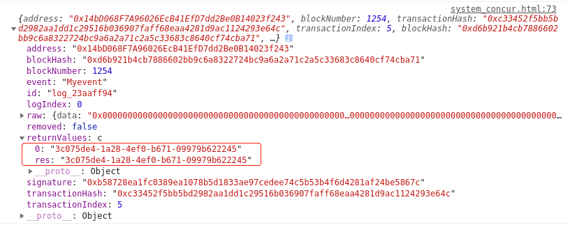
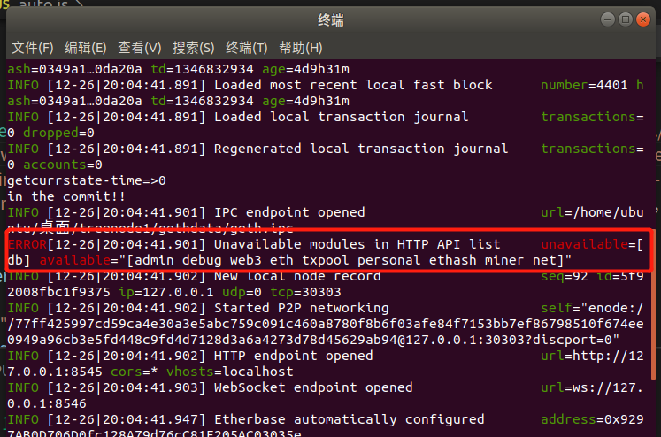
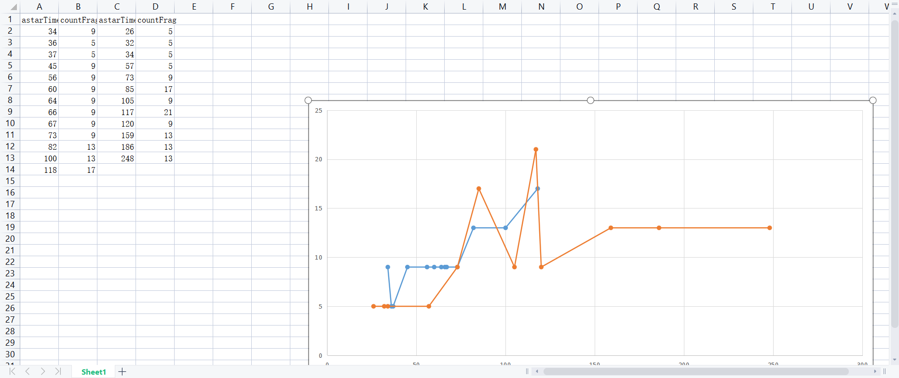

### 多节点：

账户有初始余额5e+40和没有5e+40的关键一步在于：

genesis.json文件里有无config对象：

```js
"config": {
    "chainId": 91036,
    "homesteadBlock": 0,
    "eip150Block": 0,
    "eip155Block": 0,
    "eip158Block": 0,
    "byzantiumBlock": 0,
    "constantinopleBlock": 0,
    "petersburgBlock": 0
  },
```

但是加上config对象之后，两节点久久链接不上

两节点链接不上，可能跟新建不新建账户无关，而是跟genesis.json的config对象有关，

去掉config对象试试能不能链接上：

去掉config后出现如下warn：


链接未成功


去掉alloc中的账户，再重新尝试链接：

还是有warn：


说明链接不成功可能不是genesis.json的配置问题，

之前用树状geth链接成功了，所以或许是用传统区块链geth1导致不能链接的


下面探索是否是geth和geth1两者的问题：

把所有geth1换成geth

链接成功

下面环境换成树状区块链

在树状区块链里测试，没有genesis.json里的config对象的条件下能否初始化巨额账户：

不可以：


加上config对象再试一次：

初始化巨款成功：


但是加上config后链接没有成功

尝试：

1.有config，不加账户直接链接

​	不行

2.去掉config，不加账户链接

​	行

3.去掉config，加账户能否成功？

​	有账户但是没钱

4.修改config为：参考

[链接]: https://www.jianshu.com/p/45c1dc054a58	"geth v1.8"
[链接]: https://blog.csdn.net/loy_184548/article/details/78002074?utm_medium=distribute.pc_relevant.none-task-blog-2~default~baidujs_baidulandingword~default-0.no_search_link&amp;spm=1001.2101.3001.4242.1	" geth v1.6"


```js
"config":{  
        "chainId":91036,
        "homesteadBlock":0,  
        "eip155Block":0,  
        "eip158Block":0  
    }, 
```

​	有账户但是没钱

​	可以链接节点

5.产生怀疑，将config改回：

```js
"config": {
    "chainId": 91036,
    "homesteadBlock": 0,
    "eip150Block": 0,
    "eip155Block": 0,
    "eip158Block": 0,
    "byzantiumBlock": 0,
    "constantinopleBlock": 0,
    "petersburgBlock": 0
  },
```

​	有钱......

​	不能链接结点

6.修改config为：

```js
"config": {
    "chainId": 91036,
    "homesteadBlock": 0,
    "eip150Block": 0,
    "eip155Block": 0,
    "eip158Block": 0
  },
```

​	有钱！

​	不能链接节点

7.修改config为：

参考

[链接]: https://blog.csdn.net/z2431435/article/details/112714865


```js
"config": {
    "chainId": 666,
    "homesteadBlock": 0,
    "eip150Block": 0,
    "eip150Hash":"0x0000000000000000000000000000000000000000000000000000000000000000",
    "eip155Block": 0,
    "eip158Block": 0,
    "byzantiumBlock": 0,
    "constantinopleBlock": 0,
    "petersburgBlock": 0,
    "istanbulBlock": 0,
    "ethash": {}
  },
```

​	有钱

​	不能链接

8.修改config为：

```js
"config": {
    "chainId": 91036,
    "homesteadBlock": 0,
    "eip150Block": 0,
  },
```

​	有钱

​	不能链接

9.修改config为：（去掉150）

```js
"config": {
    "chainId": 91036,
    "homesteadBlock": 0,
    "eip155Block": 0,
    "eip158Block": 0,
    "byzantiumBlock": 0,
    "constantinopleBlock": 0,
    "petersburgBlock": 0
  },
```

​	有账户没钱

​	能链接

**解决方法：**两个节点的genesis.json文件要完全一致，在节点1里生成账户之后要把这个文件copy到节点2的文件夹里再初始化节点2，这样两节点才能链接成功。

**简化生成账户方法：**在节点1里生成多个账户记录到genesis.json里，然后直接复制到节点2的文件夹里，再把节点1的keystore文件里的账户copy到节点2里初始化节点2，这样，在两节点链接后，节点2能利用节点1的账户。


11/24例会之后的计划：

同步和并发，做实验和研究底层看是否会有冲突。

1. 设计两个乘客同时调用车的场景，与这两个乘客相距最近的车是同一辆车，在较远处再设置一辆车，看返回结果是否真的是同一辆车。(修改system-concur.html系统)

   1. 两节点同时调度车辆，两次调用返回的是同一辆车

      

   2. 终于找到bug了：如果智能合约函数里有对智能合约内部对象内容的修改，则web3调用智能合约时使用的**方法应为send**，**使用call方法无法改变智能合约内部值。**（可能是这个原因）

   3. 并行解决方案：

      1. 方案一：想办法在寻找最近车辆的函数中同时改变车辆的status（实现失败，call不能修改合约状态）
      2. 方案二：将寻找最近车辆和改变status的两个逻辑分开，用.call去找最近车辆，用.send去改变车辆的status
         1. **最终采用方案二**，利用智能合约assert进行状态校验，如果车辆已经被调度，则重新执行车辆调度。
      3. **如何把车辆状态的改变通知到车辆节点？**（不需要，之后可以设置车辆监听自己的路径）
      
   4. truffle部署合约遇到问题：

      ```js
      Error: [number-to-bn] while converting number "[57 49 48 51 54]" to BN.js instance, error: invalid number value. Value must be an integer, hex string, BN or BigNumber instance. Note, decimals are not supported. Given value: "[57 49 48 51 54]"
      ```

      1. 尝试去掉启动命令的websocket字段，用原始的树状区块链命令启动（失败，报错相同）

      2. 换成传统区块链geth1进行初始化和启动，部署合约成功，先用传统区块链进行监听的实现，监听实现成功

         监听结果：

         

两乘客同时发出请求，系统分别调度两辆空车：


调度系统的架构：


系统的调度流程：


修改交互方案如下：


乘客端浏览器：

​	维护乘客位置轨迹(√)

​	发出乘车请求（√）

​	记录车辆id，尝试改变车辆状态（√）

​	显示车辆导航路径（√）通过astar算法调用显示

​	

车辆端浏览器：

​	维护车辆位置轨迹（√）

​	监听改变状态的请求（监听返回车辆的id、乘客的id和乘客的位置）

​	确认是否接客

->接->**运行导航算法**（通过自己和乘客的位置√）->**存储导航算法结果（传入车辆id，算法结果，乘客id），触发监听（返回乘客id）**->乘客收到监听，调取导航算法结果（√）

->不接->**改状态为空车，并触发监听事件**->乘客收到监听事件，获悉取消交易


做完整个流程，车辆接到乘客后，通过合约获取乘客的重点，并获取到去终点的路径；（√）

将车辆和乘客的轨迹文件分开，每个文件只维护一个角色；（√）

将车辆和乘客的uuid换为智能合约账户id；（√）


先做多车乘（√多个浏览器分别一对一服务司机和乘客）

地图合约和导航合约分开，将地图存储合约和车乘信息合约分开部署；（√）

再做多节点（节点同步遇到问题，不成功）


多节点同步出错：


导致无法进行数据的同步，寻找原因：

 1. 可能是原有节点链太短，让原有节点继续挖矿，链到一定长度之后就可以同步了（亲测无效）

     1. 

        eth挖过了128块，还是没有用

        

 2. 网络问题，或者端口没打开之类的问题，重启（无用）

 3. websocket参数导致的错误，采取之前没有使用websocket的geth命令（仍然报错）

 4. genesis.json文件里写的chainId和geth启动参数的networkid不一致，修改为一致（仍报错）

 5. 可能是节点二同步了节点一的账户的问题，节点二先不同步节点一的账户（仍报错）

 6. 节点一没有事先挖矿，addpeer之前先让节点一挖几个块出来（无用）

 7. geth参数问题，将参数中的数字都加上引号（无用）

 8. 账户未解锁的问题，先让两边的账户都解锁（无用）

 9. 师姐成功的命令里没有指定rpcaddr，删除geth启动命令的rpcaddr（无用）

 10. geth命令的先后次序问题，采用师姐实验成功的次序（无用）

 11. 第一次同步后，把第二个关掉再重新打开（无用）

 12. 第一次同步后，把第二个节点的db删掉再重新初始化（无用）

 13. 改为在节点一中add节点二（无用，报错相同）

 14. fast-sync的模式不行，改用full的模式（**可以成功同步**）

     [参考链接]: https://github.com/ethereum/go-ethereum/issues/14420

     

      	1. 
      	2. 

     显示同步成功


同步后，节点一（端口8546）服务乘客，节点二（端口8548）服务车辆，多车乘系统可以正常运行。


**触发event事件需要用send方法**


1. 增加乘客结束付账的阶段，可以根据里程来计费

   1. 通过web3.eth.sendTransaction来进行转账交易

      [参考链接]: https://web3js.readthedocs.io/en/v1.3.1/web3-eth.html#sendtransaction

      

   2. 通过自定义代币在合约中进行转账交易（意义不大过程繁琐）

      [参考链接]: https://blog.csdn.net/weixin_39842528/article/details/81034972

      ```js
      pragma solidity ^0.4.2;
      
      contract MetaCoin {
      //通过映射查找账户对应的余额
      mapping (address => uint) balances;
      //触发交易事件
      event Transfer(address indexed _from, address indexed _to, uint256 _value);
      
      //初始化调用合约账户的余额
      function MetaCoin() {
      	balances[msg.sender] = 10000;
      }
      //写在合约上的交易逻辑
      function sendCoin(address receiver, uint amount) returns(bool sufficient) {undefined
          if (balances[msg.sender] < amount) return false;
          balances[msg.sender] -= amount;
          balances[receiver] += amount;
          Transfer(msg.sender, receiver, amount);
          return true;
      }
      //从合约中获得账户的代币余额
      function getBalance(address addr) returns(uint) {undefined
      	return balances[addr];
      }
      
      ```

      

2. 车辆送完客后改变状态，继续维护位置

在树状区块链上部署合约并进行同步实验，树状区块链多节点同步实验成功


决议：

写一个转账合约，

还有个方式，就是设计一个合约，合约中间根据里程先算好钱数，然后让乘客把钱付给合约，等到站后，乘客确认，再把钱转给车辆

合约内算钱，导航算法结果从车辆端发回记录，计算钱数，乘客到站后付钱，合约把钱转给车辆


1. 乘客和司机的客户端不用自己手动调取地图

   1. 先改成自动初始化合约和调取地图，调取地图的位置固定为wx4e（√）

2. 把网格地图改成支持双行的(√)

   1. 画出双行地图，双行地图单元：

      

      生成的双行地图效果：

      

      

3. 乘客的当前位置，起点，终点，指导乘客去上车点

   1. 通过当前位置指导上车点？...（放弃，改用原措施）

4. 设置乘客需求超时反馈（超时时间——指定一个固定时间）

   1. 合约没匹配到车就返回一个空结果，乘客端收到空结果会轮询直到超时（√）

5. 乘客上车触发使能操作，车辆才可以去终点（将导向起点与导向终点分成两次，乘客上车后，司机获得乘客位置，执行导航到终点的算法）

6. 到终点之后告诉乘客付钱，乘客完成支付，代表乘客下车，车辆置空，维护位置，可接下一单

   1. 做一个一车接两单的实验


接下来是多辆车（比如10辆车和乘客），脚本自动化，寻找自动化工具，有跟浏览器交互的工具，找一找这种工具，写自动化脚本让乘客和司机进行交互


毕设的主要描述点：

1. geohash矢量地图添加功能
2. geohash计算距离速度优化
3. 智能合约中实现基于geohash的astar路径导航
4. 车辆调度的就近逻辑设计，如何避免并发冲突
5. 车辆调度系统的架构设计和流程设计
6. 导航路径结果的优化

写一个纪要


2021-12-13与向老师交流纪要

1. 进行了单车乘的全部流程展示，阐述了转账逻辑和车辆状态转换的逻辑
2. 向老师检查了调度系统的灵活性
3. 目前的模拟地图全是单向的，建议改为双向模拟地图，单车乘流程上再进行一些优化
4. 老师建议整理一下毕设的主要论点，写成一个文档记录
5. 规划了一下大致工作，本周完成单车乘的完整流程，放假之前要完成多车乘的自动化流程


完成1次调度+1次结算+2次调度+2次结算


优化导航算法返回的路径（修改paths的结构体，返回的路径粒度更细）


去掉了地图的报错，**鼠标掠过地图上的道路时不再触发报错**


单车辆连续接送两单乘客事件流程完成：


2021-12-15

做四乘客两车辆的手动实验

2021-12-16展示交流

展示了四个乘客和两辆车的模拟调度实验：

向老师建议：

1. 浏览器页面设计为两种：乘客、司机。每种页面的逻辑对不同用户都是一样的，只是根据用户身份的不同来获得不同的位置数据等。这样可以方便实验的自动化进行。
2. 乘客和司机打开自己的页面，传入自己的id和位置数据等
   - 司机打开页面之后登录自己的id开始工作，将自己的位置报告给系统
   - 乘客打开页面登陆自己的id报告自己的起点和终点，（登录id，输入起点和终点）

修改起止点需求文件，让乘客在不同的时间自动去提需求，从而支持自动化

每次打完车清理掉之前的导航轨迹，方便展示


写一个按行列生成点的脚本(√）


接下来是多辆车（比如10辆车和乘客），脚本自动化，寻找自动化工具，有跟浏览器交互的工具，找一找这种工具，写自动化脚本让乘客和司机进行交互


将genesis.json文件的difficulty字段难度改成0x1，数据上传速度还是很慢

下载selenium自动化工具和chrome驱动：

1. 查看要下载的驱动版本：

   [参考]: https://blog.csdn.net/Lingguo_0921/article/details/108686253

   


2. 安装selenium


3. 测试selenium：

```python
#python3 test.py结果为：百度一下，你就知道！
from selenium import webdriver
from selenium.webdriver.chrome.options import Options
import os

chrome_options = webdriver.ChromeOptions()
chrome_options.add_argument('--headless')
chrome_options.add_argument('--no-sandbox')
chrome_options.add_argument('--disable-gpu')
chrome_options.add_argument('--disable-dev-shm-usage')
chromedriver = "/usr/bin/chromedriver"
os.environ["webdriver.chrome.driver"] = chromedriver
driver = webdriver.Chrome(chrome_options=chrome_options,executable_path=chromedriver)
driver.get("https://www.baidu.com")
print(driver.title)
driver.quit()
```


测试成功


```python
#将同一个HTML文件打开两次
wd1 = webdriver.Chrome('/usr/bin/chromedriver')
wd1.get('file:///'+os.path.abspath('sys_passenger1.html'))

wd2 = webdriver.Chrome('/usr/bin/chromedriver')
wd2.get('file:///'+os.path.abspath('sys_passenger1.html'))

#可以打开两次，试试能不能运行两套逻辑
```


把数据写成对象数组，

通过id在数组中去找对应的数据


2021-12-21多端自动化

车辆到起点为黄色，乘客到起点为蓝色，车辆送到终点为绿色。

修改passenger的逻辑使其支持将乘客从自己的位置导航到起点

用for循环打开多个浏览器

用定时器执行for循环中的代码


用横着的直线模拟需求和轨迹，从左到右依次是车辆、乘客起点、乘客终点


统计数据

正确性

按顺序统计乘客从提出需求到分配到车辆的时间

按顺序统计调度算法运行所需时间，及其和调度结果的距离和道路数量的关系

按顺序统计存储路径所需时间

按顺序统计读取路径所需时间


利用python中的多线程thread同时打开多个浏览器

​	遇到问题：vehicle浏览器中途退出，

​	解决方法：是因为浏览器对象wb2在函数内部生成，函数执行完毕后清除了浏览器对象

[参考]: https://blog.csdn.net/qq_39115446/article/details/121651193

​	遇到问题：同时打开4个浏览器线程，ubuntu系统卡死

​	解决方法：将多线程thread改为多进程process

​	遇到问题：增加乘客和车辆的数量后，有的账户失效

​	解决方法：之前的乘客id后来变成了车辆的，造成合约端身份信息杂糅，重新部署traffic合约即可


自动化执行四乘客+四车辆，基本流程执行成功：


1. 用两个文件分别维护所有乘客和所有车辆的信息完成4乘客*4车辆的自动化调度流程（自动化工具：基于python的selenium）[链接](https://github.com/oscourse-tsinghua/investigation-cjzhuang2020/blob/main/多节点调度系统.md)
2. 测试脚本的完善：脚本的配置能力；
3. 田字格上的实验与真实地图上的实验应该不用改系统；
4. 学位论文：有时间时，开始做学位论文的调研工作；
5. 信誉值：可以在出租车调度系统中；意义很大，难度应该不大；


1. 考虑加信誉值的可能性：是可能的；
2. 信誉值在应用的语意解释；意义：对交易的安全是重要依赖；
3. 测试脚本的完善：脚本的配置能力；（√）
4. 补全必要的部分区块链注册账户自动化；（有点难）
5. 看区块链底层能不能给合约提供接口提高系统的适配性，比如用车高峰和闲时用车调取实验的性能数据等


12-23、24

补全必要的部分区块链注册账户自动化：

​	报错：-bash: ./test: Permission denied

​	解决：

[参考]: https://www.cnblogs.com/buzheng/p/12739135.html

​	

使用gnome-terminal打开新的控制台

```shell
$ gnome-terminal -x bash -c "ls; exec bash"
$ gnome-terminal -e 'bash -c "ls; exec bash"'
```


​	报错

​	解决方法：

[参考]: https://blog.csdn.net/qq_39750907/article/details/107337720


​	通过websocket建立web3链接，用web3.eth.getAccounts测试链接：

​	报错

​	改了一万年了也改不出什么来，后来发现是指令执行的太快了，打开控制台命令发出，用sleep函数延迟一秒之后，再发送web3指令即可。

​	报错：

​	用web3.eth.personal.newAccount时总有这个报错，就算是手动输入指令打开区块链也解决不了bug

​	分析：

​	会不会跟这个报错有关系？

​	删掉rpcapi里的“db”，重新启动

​	还是不行。。。

​	解决：靠想象力解决的，personal是rpcapi里的参数，既然现在用的是websocket，那么是不是存在wsapi这样的字段呢？搜了搜还真有：

[参考]: https://blog.csdn.net/mongo_node/article/details/80672626

​	


看区块链底层能不能给合约提供接口提高系统的适配性，比如用车高峰和闲时用车调取实验的性能数据等

区域调度和全局调度的时间对比实验

学位论文：有时间时，开始做学位论文的调研工作；


考虑加信誉值的可能性

信誉值在应用的语意解释；意义：对交易的安全是重要依赖；


整理一下吴玥仪和董斌参考过的论文：

吴：

1. ​	文献[1]利用区块链为智能车辆实现了一种安全的交易体系结构，将数据与区块链交易分离，可以在车辆保险费用缴纳等方面进行应用。
2. ​	目前，以太坊智能合约的应用较为广泛。文献[2]将以太坊账户作为车载网参与者的个人账户，通过定制智能合约实现可查询交通违法记录、缴纳各项费用的自管理系统。
3. ​	位置验证是证明一个人在某个时间处于某个确定的地理位置的一个数字签名[3]。车载自组网中要求车辆提供具有时效性、准确性的位置验证，以便于更多的车辆行驶信息能有效地应用于更多基于位置的服务（Location-Based Service，LBS）。
4. ​	目前，多数车辆位置验证采用的是依赖于网络基础架构的集中式验证，主要通过无线接入点和蜂巢网络为用户提供位置验证。
5. [4-5]
6. ​	不依赖网络基础架构的验证方式通常利用邻近车辆或车上的移动设备获取有效的位置验证。该验证方式要求参与设备具有一定的短距离通信功能（比如蓝牙）[6]，通过带有私钥签名的点对点传输完成验证，并在互联网中传播验证结果；特别地，对于分布式的位置验证系统，传播后的位置验证结果被写入区块链中[3]。 
7. ​	中心化的车辆信誉管理系统通常使用一个服务器作为完全可信的权威机构，车辆之间的反馈被统一提交并在服务器上进行信誉的计算[7]
8. ​	对于去中心化的信誉管理系统，信誉计算的压力被分配到了车载网中的各个节点上，通常在各车辆[8]
9. ​	或是路侧单元（Roadside Unit，RSU）[9]内部执行；
10. ​	[10]提出了一种基于区块链技术的去中心化车辆信誉管理方式，利用 RSU 进行数据处理和信誉维护，并通过区块链结构保证数据的同步和安全性，降低单个 RSU 故障对系统带来的影响；同时，该文章提出了一种基于消息传播的信誉计算方法，通过车辆与消息描述事件之间的距离完成消息评价。
11. ​	文献[11]
12. ​	和[12]同样基于消息进行信誉更新，前者以车辆间的信号接受强度（RSS）作为评价指标，后者则考虑每条消息影响到的车辆规模。
13. ​	文献[13]中的车辆信誉受车辆间数据信息交易结果的影响，对于每一台车辆维护一个朴素贝叶斯网络，在其叶节点中更新该车辆各个交易身份对应的不同信誉值。
14. ​	文献[14]提出了在物联网的边缘计算中，完成时间更近的互动结果在用户声望计算中占有更大的权重。
15. ​	文献[15]实现了一个基于区块链的车辆修正与信誉评估系统，仅基于车辆自身提供的数据（如行驶速度、位置修正结果）进行信誉计算。
16. ​	地图展示。浏览器端使用了 leaflet（一个开源的 JavaScript 互动地图库，适用于移动设备）[16]进行地图及车辆行驶路线的展示。
17. ​	本章使用了 OpenStreetMap（OSM）[17]提供的开源地图获取北京市的道路信息，
18. ​	并利用 osm2pgrouting[18]转换工具提取出道路数据信息进行存储。


首先修改账户和信息匹配机制，使得可以有需求就能产生，并且可以调节需求密度

如何让账户和需求根据产生的密度来匹配？

乘客第一次发出需求后，第二次发出和第一次不一样的需求，

车辆第一单接送完毕后，第二次接单时要清理掉第一次的轨迹（√）

乘客第二次发单时也要清理掉第一次的轨迹（√）

设置多少个乘客在多长时间内发送多少个请求


时间段（每个乘客的两次需求之间相隔多久）

需求出现的次数（在这段时间内每个乘客会出现多少次需求）

车辆数量

乘客数量

打印出搜索车辆的时间并记录


定义一个函数，输入每个乘客账户执行多少遍，每遍之间时间间隔是多少，然后开始执行

def workConfig(requestNum, requestInterval):

requestNum代表一个乘客提出多少次需求，requestInterval代表乘客提出需求的时间间隔

一个乘客第一次和第二次需求之间的时间间隔，乘客之间提出需求的时间间隔，


做一个简单的实验：

| 调度毫秒 | 乘客1 | 乘客2 | 乘客3 | 乘客4 |
| -------- | ----- | ----- | ----- | ----- |
| normal   | 6772  | 4184  | 4292  | 1863  |
| ByRegion | 2959  | 3805  | 3495  | 3431  |


## Secure Ride-Sharing Services Based on a Consortium Blockchain-2020

15 September 2020

​	针对当前拼车服务存在的安全威胁和中心化问题，提出了一种基于联盟链的安全拼车方案，通过基于属性的代理重加密算法，保证数据交互的安全性、保密性和隐私性。

1. 首先，乘客预设访问结构并使用基于属性的加密对数据进行加密。然后将密文发送到路边单元 (RSU)，后者将拼车请求广播给司机。司机收到请求后，将行程属性发送给RSU，RSU根据收到的密文和行程属性进行拼车匹配，然后密文重新加密发送给匹配的司机。
2. 其次，主节点使用改进的 Delegated Proof-of-Stake (DPoS) 共识来验证拼车记录，验证成功后存储在区块链上。如有争议，可利用区块数据进行追溯。
3. 第三，司机和乘客在共享乘车后使用**可信度机制相互评分**。此外，可信权限可以揭示恶意用户的真实身份。最后，对提出的方案进行了安全分析和性能评估。结果表明，方案不仅**满足了拼车服务的安全和隐私要求，而且有效地抵御了潜在的安全风险**。因此方案是可行的、高效的，适用于拼车服务。 

​	可信度机制旨在鼓励路边单位为乘客匹配合适的驾驶员，并提高驾驶员和乘客的可信度。

​	此外，为驾驶员和乘客提供有条件的隐私，即保护乘客和驾驶员的身份隐私，但在发生争议时，可信度机制可以追踪并披露恶意用户的真实身份。

​	优点：通过信誉值来评估乘客和车辆的可信性，缺点：评估方法单一，只参考服务评分。


# Blockchain-enabled Identity Verification for Safe Ridesharing Leveraging Zero-Knowledge Proof

*27 Oct 2020*

许可发布者：许可发布者是向数据所有者和数据验证者发布身份信息（例如，驾驶执照号码）和密钥对的可信实体。在实践中，机动车辆管理局（DMV）等机构可以作为区块链网络中的许可发布者。

 • 司机：司机是区块链网络中的一个客户，他/她拥有自己的身份信息，并希望在不透露信息的情况下向乘客证明自己的身份。

 • rider（拼车的乘客）：rider是区块链网络中的一个客户端，希望在行程开始前安全地验证司机的身份。

 • 对等节点：对等节点是在许可区块链网络中托管账本和智能合约的元素，同时也充当为乘客验证司机身份的数据验证者。在我们的系统中，对等节点由创建分散网络的多个组织组成的联盟部署和管理。

 • 许可区块链：许可区块链（在我们的原型中，Hyperledger Fabric）被用作架构的控制器，并作为用于保存证明记录和行程信息的防篡改交易账本。 

​	在每次出行开始之前，驾驶员的身份将通过建议的零知识证明协议进行验证，而不会向网络中的其他参与者透露敏感信息。区块链网络维护一个分布式账本，用于记录出行信息和证明记录。

​	进行了交易发送量和平均事务吞吐量的压力测试

​	实验：

1. 需要达成共识的节点越多，事务吞吐量的峰值越低
2. 交易发送速率一定时，需要达成共识的节点越多，平均事务延迟越高
3. 成功率：有多少交易已在区块链上成功处理和写入（100%）

探讨：

​	1. Ride Log Tampering Attack:在建议的系统中，新生成的行驶日志以交易的形式存储在区块链上。由于区块链的不可变特性，我们的系统将拒绝任何篡改现有骑乘日志的企图，确保所有记录信息的数据完整性。因此，一旦记录了行程信息，任何实体都不会对其进行修改

​	2. Fake Driver Attack:恶意车辆攻击是指恶意车辆通过向验证器提供假身份信息来欺骗ZKP验证过程的情况。然而，ZKP协议在设计上能够抵抗伪造身份的破坏，从而防止这种类型的攻击。例如，如果攻击者打算欺骗验证人，但实际上拥有不正确的身份 


优点：提出了基于ZKP实现的车辆身份认证，并对消息进行加密

不足：系统只是原型，理论较为抽象，实验的设计有点莫须有

感觉是强行加入ZKP的概念，如此的话，我的系统可以引用边缘计算、数字孪生等概念


# A Light Blockchain-Powered Privacy-Preserving Organization Scheme for Ride Sharing Services

**Date of Conference:** 25-28 May 2020

**Date Added to IEEE \*Xplore\*:** 30 June 2020


1. 在以太坊平台上实现，利用其去中心化、安全性隐私性
2. 1）拼车者向区块链发布请求（行程的时间和位置均加密）；2）司机发送加密报价；3） 拼车者从收到的报价中选择最佳匹配。

老生常谈的信息加密，用户资格认证

3.  发布招标合同需要大约 400K gas。 需要 89K gas 以便司机可以将加密的报价以及投标价格发送到投标合同。 最后，需要 200K gas 来检索司机的报价。 这些成本可以转化为计算我们计划的直接货币成本。（直接用交互的gas做成搭车成本，虽然用当时的以太坊美元市价算了算，说是很实惠，但感觉过于理想主义，毕竟这两年以太坊价格翻了十倍，实验部分主要计算这个gas是不是有点过于划水？）
4. 我们的评估表明，我们的方案是可行的，具有可接受的气体消耗和瞬时成本。 在未来的工作中，我们将考虑到乘客和司机在 RSS 中的信任程度，设计一个隐私保护组织方案。 


优点：在未来工作中提出了信任程度的设想

缺点：并没有设计出能干活的系统


# A Comprehensive Review of Authentication Schemes in Vehicular Ad-Hoc Network

**Date of Publication:** 18 February 2021 

本文详细讨论了 VANET 中身份验证方案的分类：

1. 透彻地分析 VANET 及其要求和提出的挑战。
2. VANET 中的身份验证基础以及 RSU 如何提供已呈现的服务。 
3. 讨论了各种认证方案及其其安全性、隐私性和可扩展性的要求。 
4. 讨论区块链、5G、SDN等最新技术在VANET身份验证中的应用。 

区块链：匿名、安全可信、去中心化


[59]的作者提出了基于区块链的 VANET 安全支付方案，采用两种场景（i）公园收费管理系统和（ii）电子收费。支付方案即。 (i) V-R 交易和 (ii)有效且稳健的 V-Rs 交易。在这种情况下，只有 RSU 参与共识，所有交易自动在智能合约中运行。


侧重于安全验证，并没有考虑在实际应用中让RSU起到调度和导航服务的作用


2022-1


1. 自动化测试脚本完善初始化的账户数量可以作为参数进行自动初始化（账户数量可变）
2. 乘客在浏览器中登陆后，输入自己的id，在前端输入起点和终点，用另外一个配置文件通过乘客的id去寻找起点终点，起点终点可以通过类似坐标转成geohash，这些通过web服务器去完成
3. 汇总已有出租车调度系统的已有结果（代码、文档、可能的系统改进工作）；
4. 检索最新的在分布式系统中实现车辆调度、导航的论文工作


搞好注册账户的自动化脚本，可以自动初始化并分配车辆和乘客的账户（√）

将所有账户格式化，输出为一个genesis.json文件，方便创建节点（√）

将乘客账户写到名为乘客的.py文件里，将车辆账户写到名为车辆的.py文件里（自动化√）

将所有车辆位置均匀地初始化在地图的路口（√）


自动化解锁账户（unlockAccount）的脚本文件（√）

​	


车辆起始位置：按路口情况进行均匀分布

乘客**起点**和**终点**：在路口集合中随机挑选两个不一样的点分别作为**起点**和**终点**


**自动化流程：**

1. 先按照指定数目创建车辆和乘客的账户，创建同步的区块链节点
2. 根据路口集合，将各个车辆的位置在地图上随机并均匀地初始化，
3. 手动设置每个乘客的打车时间间隔和打车次数，乘客每次打车时，登录自己的账户，然后获取随机生成的出发点和目的地，进行自动化打车流程，
4. 统计自动化运行过程中的时间数据等指标。


测试报错：（四个乘客客户端只打开了一个），解决：重启虚拟机

​	


1. 根据geohash前缀进行区域车辆调度
2. 根据geohash和邻居geohash进行区域车辆调度


**出租车调度系统实验设计：**

利用树状区块链的**区域信息查询**功能：

​	每次在智能合约中遍历所有的出租车，来选择距离乘客最近的车辆，这无疑是低性能的；

​	优化：把全局车辆调度改为区域车辆调度

​	优化方法：

  		1. 利用geohash**前缀区域**搜索，取乘客起点geohash的前六位geohash，查询区域内车辆，如果没有合适的车辆，就搜索5位geohash的区域内车辆，以此类推；
  		2. 利用geohash**邻居区域**搜索，取乘客起点geohash的前六位geohash，查询区域内车辆，如果没有合适的车辆，就通过轮询的方式依次查找该区域周围相邻8个区域，查询邻居区域内是否有合适的车辆。

利用区域信息查询可以优化车乘匹配的时间，具体时间结果可以通过**对比实验**来证明：


​	场景：乘客起点和终点位置随机设定，在地图上均匀分布，车辆起始位置随机均匀分布，

​	小规模：准备5辆车，5个乘客，每个乘客可以连续发送10次乘车请求，共50次请求记录


收集数据：

1. 每个乘客从发出需求到分配到车辆的等待时间，计算总时间和平均等待时间，验证区域调度对性能是否提升；
2. 每个车辆在工作时，从空车到接客的等待时间，验证区域调度是否降低了车辆的空车时间；
3. 每辆车从发出导航请求到接收到导航结果的时间，可以通过不同的参数粒度控制导航算法响应的快慢，对比不同参数下**起止点距离**和**响应时间**的关系曲线，可以得到合适的算法参数；
4. 统计每辆车接客和送客运行的里程，探寻里程和起止点距离的关系，看在不同环境下导航算法的“最短”的特性是否稳定；


关键词：decentralized system of navigation


**HACIT2: A Privacy Preserving, Region Based and Blockchain Application for Dynamic Navigation and Forensics（取证） in VANET**

分布式基于的平台：Hyperledger Fabric

做到的工作：

1. 集中式->分布式
2. 事务可以侦听并存储在一个共享的账本模块里，方便取证
3. 做到了动态导航

​	事件系统侦听新事务（以及来自其他用户的流量更新），该系统将信息转发到处理本地存储的加权图的另一个模块。如有必要，将重新计算最短路径并将其转发到在移动设备上运行的导航用户界面，从而使导航动态化。


​	应用程序通过 Intent 和 OSM 和 API 打开 OSM 和动态导航（见图 2b）。当 UI 显示导航时，后台进程会不断检查新的路径更新，如果有，则将更新的路径指令发送到 OSM 和 UI。这会导致 OSM和UI 删除当前指令生成新指令，更新 UI。  

不足：

 	1. 模块依赖对外部库的调用，区块链系统要经常跟第三方库打交道，比如动态路径的生成和改变就依赖在线OSM库，可能导致信息泄露
 	2. 没有利用到特殊的地理格式来简化算法和存储，加入基于geohash的存储、导航和调度是不错的改进


### 实验内容：

**应用系统中算法的参数调整：**

1. 导航算法——判断道路的优先级，包括两个算子：
   1. 曼哈顿函数数格子的大小；怎么做呢？先预选一个合适的数，然后进行上下浮动调节做实验，不过每次做实验好像都要重传地图数据（用testrpc传数据）,初始时格子PRECISION是8
      1. geohash误差表（[(28条消息) Geohash长度与对应精度_ununie的博客-CSDN博客_geohash网格大小](https://blog.csdn.net/ununie/article/details/96963642)）
      2. 横坐标：起点到终点的路径片段数量（路径片段越多，曼哈顿函数的执行次数越多），纵坐标：路径规划的时间，
   2. 道路的长度cost，要乘以一个系数P，来当作权重
   3. 改变参数并测每辆车从发出导航请求到接收到导航结果的时间，不同的参数粒度会影响导航算法响应的快慢，对比不同参数下**起止点距离**和**响应时间**的关系曲线，可以得到合适的算法参数；
2. 车乘匹配算法：需要调节算法中数格子的参数，来控制数格子的大小，数出来的格子数量就是该车辆相对乘客的距离。
3. 优化计算距离的算法：前缀匹配算法对智能合约上通过geohash计算距离的速度的优化

**应用系统的特征分析：**

1. 无树状区块链支持的系统，使用全局查询，进行小规模实验，收集数据：
   1. 每个乘客从发出需求到分配到车辆的等待时间，计算总时间和平均等待时间，验证区域调度对性能是否提升；
   2. 每个车辆在工作时，从空车到接客的等待时间，验证区域调度是否降低了车辆的空车时间；
   3. 统计每辆车接客和送客运行的里程，探寻里程和起止点距离的关系，看在不同环境下导航算法的“最短”的特性是否稳定；

**树状区块链的特征分析（规模变化）**

1. 有树状区块链支持的系统，将全局查询车辆改为区域查询车辆，使用区域查询算法（当前区域没有就查找邻居区域），收集数据同上。


astar导航时间和导航路径片段的关系，蓝色为8位格子，橙色为7位格子，x和y的线性关系不明显，7位和8位数格子的区别也看不太出来




影响导航时间的因素：导航路径的片段数，每条片段距终点的距离，


换一种方式：横坐标是1234，4辆车，纵坐标是这4辆车接送乘客的总时间，不同的折线代表不同的geohash数格子精度（PRECISION），由于精度为7的时候格子长度为76米，不符合现实的使用条件，且7位精度下的导航算法运行速度甚至更慢；

而8位精度下格子长度为10米左右，总时间相对其它精度是最快的，故拟采用8位geohash作为导航算法的计算精度。（**果真？**）


​	在导航算法中，下一条道路是否优先被选择由两个算子因素决定，算子1是已经选择好的路径的cost（本文中用路段的长度作为参考的cost，单位是m）；算子2是下一条道路的末尾距离终点的距离。

​	若算子2的距离由8位geohash块来计算，那么所数出来的块中，每一块的长度在10-20米左右，这样以来，算子1由于单位是米，在数值上所占的比重会更大，但是智能合约不支持浮点数类型，故算子1的参数只能是整数，显然我们不能再给算子1乘上比1还大的系数了。	所以为了避免导航路径较长时导致的算子1数值过大，掩盖算子2数值的问题，**算子2的geohash采用9位精度计算**（**9位geohash块的规模在2-5米左右**，与算子1的**单位长度接近**，这样会**提升算法的合理性**），算子1的参数P定为1。


车乘匹配算法：需要调节算法中数格子的参数（PRECISION），来控制数格子的大小，数出来的格子数量就是该车辆相对乘客的距离。


可以看出，7位格子过宽，反而会影响筛选最近车辆的时间；而8位geohash的时候运算速度最快，8位格子长宽10-20米左右，这个范围不影响车辆的选择和调度，故可以**选择8位长的geohash**作为车乘匹配算法中计算车乘距离的参数。


**前缀匹配算法：**基于11位geohash的计算优化到**9位，速度优化17.04%**，基于11位geohash的计算优化到**8位，速度优化26.34%**


区域调度算法：

完成九宫格区域调度算法，可调度乘客位置前六位geohash块和其周围8个相邻块区域内的车辆，两次控制变量实验表明了区域调度算法的效率，相比全局遍历车辆查询确有提升：


