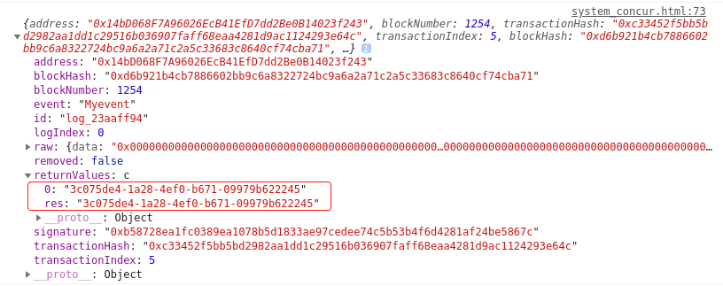

# event事件监听实现过程

事件监听需要通过websocket服务，ganache-cli提供的测试环境无法提供socket服务，故直接使用geth创建私有链，同时启动websocket，参数设置要如下完全一致：

```jsx
# 初始化
geth1 --datadir ./gethdata --networkid 91036 --port 30303 --rpc --rpcaddr 127.0.0.1 --rpcport 8545 *--rpcapi 'db,net,eth,web3,personal' --rpccorsdomain "**" --ws --wsaddr "localhost" --wsport "8546" --wsorigins "*" --nodiscover --allow-insecure-unlock --dev.period 1 init ./genesis.json
# 启动
geth1 --datadir ./gethdata --networkid 91036 --port 30303 --rpc --rpcaddr 127.0.0.1 --rpcport 8545 *--rpcapi 'db,net,eth,web3,personal' --rpccorsdomain "**" --ws --wsaddr "localhost" --wsport "8546" --wsorigins "*" --nodiscover --allow-insecure-unlock --dev.period 1 console
#原始博客的启动参数
geth --datadir ./gethdata --networkid 15 --port 30303 --rpc --rpcaddr 0.0.0.0 --rpcport 8545 --rpcvhosts "*" --rpcapi 'db,net,eth,web3,personal' --rpccorsdomain "*" --ws --wsaddr "localhost" --wsport "8546" --wsorigins "*" --nat "any" --nodiscover --dev --dev.period 1 console
# 创建账户
personal.newAccount("123456")
# 解锁账户
personal.unlockAccount(eth.accounts[0],"123456",15000)
# 查看账户余额
eth.getBalance(eth.accounts[0])
```

合约中定义事件：

```jsx
//返回车辆id
event Myevent(
      string res
  );

//当车辆状态改变后触发事件，返回车辆id
function setVehicleStatus(string memory uuid) public {
      assert(vehicles[uuid].status == 0);
      emit Myevent(uuid);
      vehicles[uuid].status = 1;
  }
```

在浏览器中监听事件：

```js
//event

mapContract.events.Myevent(function(error, event){ 

    console.log("error: ",error);

    console.log(event); 

})
```


truffle migration部署合约后，修改车辆状态，成功返回了事件：



