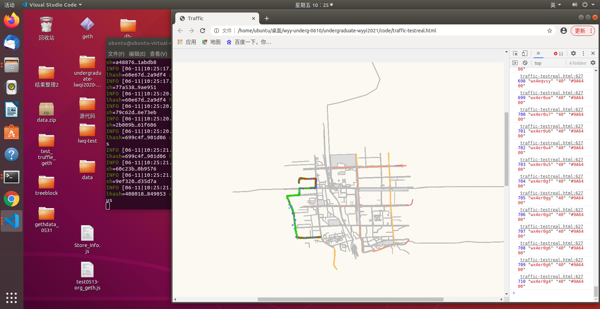
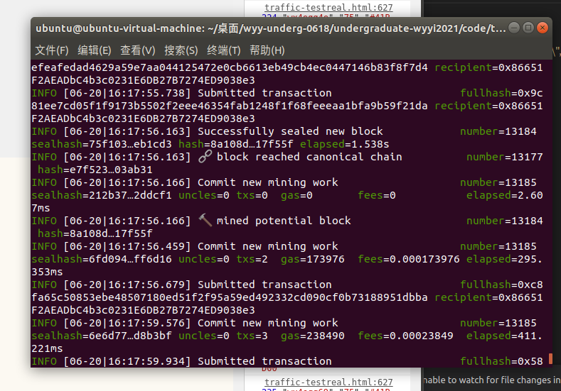
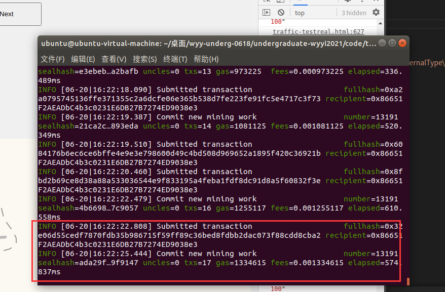
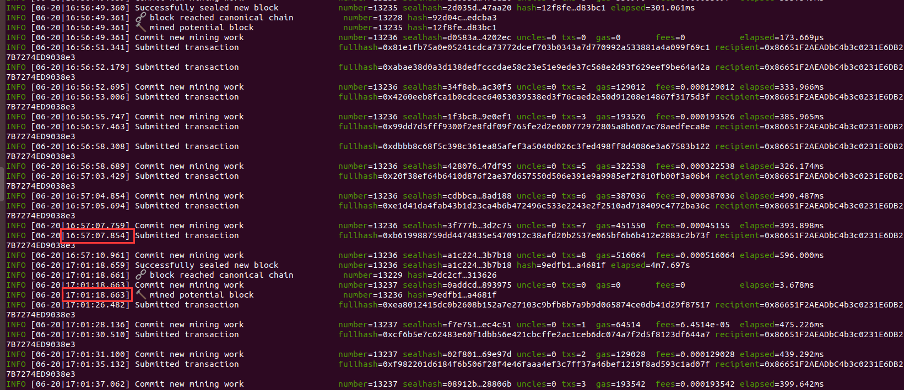
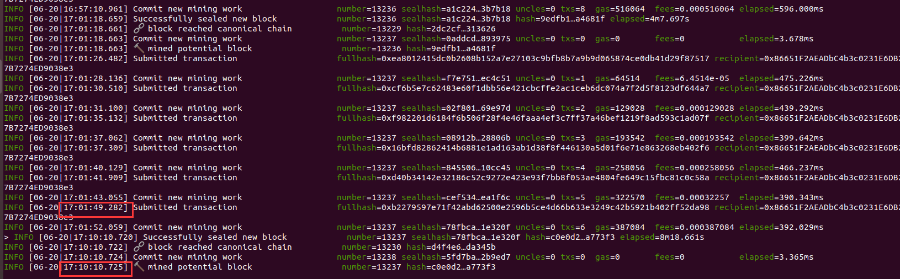
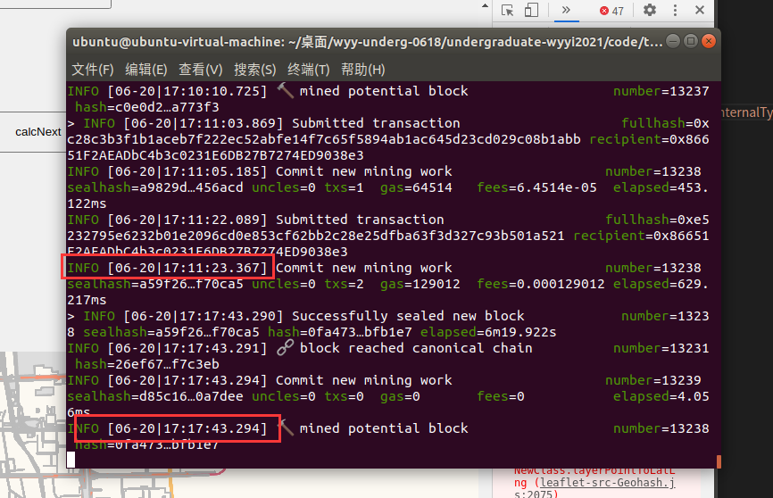

董斌+吴玥仪的工作

搞懂：

1. 如何更改轨迹数据（initTrace->locBuffer）邻居车辆点（verifyRecord->verifyRecord.js）

2. 董斌和吴玥仪分别如何标注的轨迹数据

   ```javascript
   var point = L.polyline([nb_geohash,nb_geohash],{color:nbColor,fillColor:nbColor,fillOpacity:1});
   
   	map.addLayer(point);

3. 上传信息和获取信誉值的智能合约接口发生了什么变化

4. 如何换底为geohash地图

5. 

工作：

更改智能合约算法

换底为geohash地图(将real的数据整理到geohashtile上)

更改traffic数据（轨迹改变，加入其它车辆的结点）

更改道路轨迹的标注方法


改轨迹颜色（√）

改地图数据（√）

合约在树状区块链部署


信誉值+geohashtile+树状区块链


存储好地图数据的树状区块链

吴玥仪的前端，能支持本地geohashtile，支持调用合约地图

吴玥仪的信誉值计算合约尝试部署在树状区块链上，遇到一个panic: runtime error: slice bounds out of range [:6] with capacity 0然后退出控制台的错误，原因是trafficcontract的method在send交易时没有定义位置和时间，把send格式改为（.send({from: trafficContractAccount, gas: 500000,position:"w3511111111111",txtime:278000});）即可

我认为地图画得慢，问题出在渲染的时候渲染了n层

1. 先把北京地图数据转化为geohash，在本地测试下性能

   数据存到了本地，然后打开网页速度很慢，估计就是前端画图慢的原因，并非因为区块链速度的原因

   原因：如果每个放缩等级上都要显示所有的数据，任务太大了，所以要设置minzoom来设置每个放缩等级需要显示出来的数据。

2. 然后将吴玥仪的工作加上getroads的逻辑，实现从区块链扒地图


- 如何把一个宏任务放到另一个宏任务之后？

将吴玥仪的工作改为支持对区块链地图的调用




现状：实现了 信誉值+geohashtile显示地图+树状区块链部署合约三个的结合

### 总结工作问题：

1. 之前觉得扒地图数据显示得比较慢，初步分析排除区块链慢的问题，本地渲染慢得更明显。

因为写了个本地转化地图数据的脚本，直接用本地数据渲染的也慢，分析可能的原因：

- 渲染地图时渲染层数过多导致，可能是每条数据都占用了一层的渲染导致的，解决方法：搞懂addMapLowLayer和addMapHighLayer的工作原理
- 每个zoom等级上都要显示所有的数据（跟数据里的minzoom有关），渲染任务太大了，所以要设置不同的minzoom来设置每个zoom等级需要显示出来的数据。解决方法：跟师姐交流，观察以前的实验和代码，搞懂geohashtile的优点所在，然后尝试改善
- 董斌有个GetHighWay的函数用了很多if-else，会不会对性能造成影响

2. 董斌实现的位置验证工作，位置标注不是很精确，仔细看轨迹点，并没有很好地标注在道路上，比较粗糙。
3. 吴玥仪的信誉值工作移植过来后，轨迹颜色（即信誉值）的表现可能不是很稳定，这个有待多测试。

### 规划接下来的工作：

1. 使当前三者结合的系统变得精确稳定，维护文档和GitHub仓库
2. 加入对行驶轨迹进行纠正的工作，使信誉值计算变稳定
3. 引入树状区块链的特性，观察对数据存储量的优化（还没理解细节）

### 目前的个人问题：

目前的工作和接下来规划的工作哪些可以写到自己的毕设中？工作量如何？

此外还有哪些有关方面的问题是我没发现的，需要探索创新？

关于接下来的工作有没有前人合适的工作文档或者代码、工具等资源可供学习？


1. 重现的工作：使用树状区链存储所有数据（包括地图和轨迹数据）；前端的所有数据来自于区块链；
2. 多节点信誉值同时计算，每个节点存自己的信息
    1. 节点通过普通交易存储自身位置信息
    2. 节点读取邻居节点的位置信息，完成信誉值计算
 3. 道路匹配，位置纠正。
 4. 上面三项做完可以进行独立工作，性能优化；信誉值计算的改进；
 5. 加入对行驶轨迹进行纠正的工作，使信誉值计算变稳定
 6. 协助周畅做测试


主要任务：

1. 实现多节点信誉值同时计算
2. 加入对行驶轨迹进行纠正的工作

先实现行驶轨迹纠正


先把两个合约部署到一个链上

部署好之后，可以同时显示地图和计算信誉值，但轨迹点颜色显示又出了问题，不是前端渲染的问题，合约返回的信誉值一直是0，打算重新部署一遍合约。


信誉值计算的问题：如果调用matchAll，返回的结果是不合理的，因为合约来不及计算并返回信誉值。


树状区块链不部署地图数据——底气


先把智能合约在树状区块链的情况是否正确搞明白。


搞明白信誉值是否存在了区块链上，信誉值在区块链上的交互，学习调试合约。先把吴玥仪的工作完整正确地搞到树状区块链上.

实施：

1. 测试ganache-cli+open streetmap上信誉值计算是否正常，如何判断是否正常?

   1. 一个个calc点击
   2. 直接testmatch或matchall（正常），因为genache-cli运行比较快所以信誉值更新比较准确

   可能是因为revalueByValidation没有加await导致的不能返回正确信誉值（这能加await吗？）

   吴玥仪目前github上的信誉值计算只实现了两个模块，未实现消息传播的信誉值计算。

   - 采用ganache-cli+本地geohashtile标注数据，信誉值计算正常

   

2. 测试  全新树状区块链+本地geohashtile上信誉值计算是否正常

   - 采用树状区块链部署+本地geohashtile标注数据，miner.start(1)时，直接matchall，返回的信誉值全部为初始化时的值，显然是不合适的。那么接下来试试一个个calc点击，信誉值会发生变化，目测是树状区块链每挖出一个块之后，返回的信誉值才会变化。
   - 结论：区块链每挖出一个区块，智能合约所有的交易才会被确认，想要及时返回最新的信誉值比较难，可以调慢上传和访问智能合约的速度。

3. 测试  存好地图合约的树状区块链+本地geohashtile上信誉值计算是否正常

   - 部署合约时要先挖很多块才能将合约部署好，
   - 

   - 一个个calc点击，点着点着发现不好好挖矿了
   - 

   - 这一步时快时慢，不灵敏，但是不影响功能，系统没有崩溃
   - 结论：挖块慢和交互不灵敏使前端通过web3交互时会忽略部分请求，导致信誉值计算次数的下降，但是智能合约的计算功能是正确的。

4. 测试  存好地图合约的树状区块链+区块链拉取的geohashtile上信誉值计算是否正常

   - 挖矿慢，短时间内多次使用web3发送交易后挖不出块来，要等一阵子才能挖出一个块
   - 

   - 

   

   非常慢...

   不限制cpu核数能救吗，miner.start()?——救不了，实在是太慢了...

   增加虚拟机内存，挖矿速度快了一些，但是丢包情况依然有，挖块前后与区块链进行交互，数据不能submit，挖块的速度不均匀

   在前端的两个truffleContract.methods.revalueByValidation前面加上await，可实现promise.then调用，从而保证正常交互。

5. 开题报告修改，整理今日谈话纪要。

   合并工作加一个纪要

   距离较近就可以计算信誉值，多节点各自开账户，道路匹配换成geohash

6. 出租车的事：

   1. 每辆车自己跑自己的
   2. 空车或者载客的车
   3. 乘客有乘车请求，范围内有空车，实现一个就近匹配的交易，然后交易成功或失败可以影响信誉值。
   4. 李玮祺有判断点到线距离的算法，可以有利于道路绑定。
   5. 乘客找车，车找乘客。


开题报告修改


多节点各自开一个账户，然后先实现多账户的同时运行，信誉值同时计算，然后实现车辆之间的信誉值参考计算

​	- 用时间来同步两辆车的交互

先整出一块合适的地图来

找出geohash为什么短的源头，将其加长

观察match前后是否修正

好像encode_geohash最长是8位？——把默认长度调成9位，果然准确多了


修正后的点标记位置很奇葩。。。

问一下向老师修正之前的轨迹还保留吗，因为是渐变色比较影响判断

直接使用修正函数，修正后的点存在重叠现象

找出match后重叠的原因，猜测可能是用来match的道路是经纬度的，并且道路数据不对


修改精度：李玮祺的geohash精度是10

修改匹配数据：李玮祺的匹配projection结果都是fixed1

改好精度，道路绑定可以实现，但是出现了geohash undefined的问题


1. 对比看吴玥仪的合约是否全面（还是不全，至少智能合约里没实现这个算法）
2. 将张禹的道路绑定算法弄上去（先看工作量，找到算法源码）
3. 搞明白田字格是怎么回事，学习，然后开多个账户做测试

向老师建议：把吴玥仪模拟信誉值的数据全都换成实时的，先实现田字格多节点模拟数据

例会进展：


1.找到田字格的数据和标注方法，

找到创建多个账户的方法

编出多个节点田字格数据并测试

标注出多个田字格数据

分开进行信誉值计算


做好道路绑定,找到张禹道路绑定的部分

算法参考论文：“Online map-matching based on Hidden Markov model for real-time traffic sensing applications”

实现：[在线的HMMM算法]，在这基础上做了进一步的修改。

traffic_estimation应该就是OHMMM算法

好像不是...是估计路况的

在线道路匹配的算法是用java实现的

想法：做基于实时路况的出租车调度系统？

对比projection，把李玮祺的改成张禹的逻辑

可能offline_match也是道路匹配工作，先进行projection对比

匹配算法使用两种概率估计

一个是车辆在道路的首尾还是中间

一个是车辆的投影是否在外面，夹角，是否同一条路，是否oneway

张禹的candidates排序的prop在filter函数里

对比两边filter函数

OHMMM提高的是路口处的匹配成功率


根据什么来建立与邻居节点的通信？

先找到伪数据在轨迹附近随机生成点的方法

然后实现两个点之间的识别和算法

然后实现五个点之间的识别和算法


geohash前缀匹配来判断是否在范围内

艹式轨迹，一横六竖，实现分开计算信誉值

终端的车辆发出位置验证请求，同时上传自己的geohash值，在智能合约端用for循环users和短geohash匹配找区域内是这个字符串的账户（进行一定的防抖），找到后，生成一个验证结果，在合约端计算信誉值，并返回信誉值。

1. 五个竖着的路径，需要实现先后开始
2. 需要在智能合约实现范围识别
3. 需要实现账户间交互

2.在智能合约实现就近识别：遍历users，遇到问题：区块链没有geohash的属性，在前端实现对users的遍历？

如何发现相邻车辆？

1.前端每发送十个gps就申请由区块链来一次范围查询车辆


2.前端保持字符串匹配查询，geohash匹配由前端实现

寻找合适geohash长度的过程可以写那么一两段


07/13

1. 实现真正地计算距离，参考李玮祺的计算距离代码。


2. 实现相见之后的信誉值有所变化，互相参考计算信誉值。


3. 吴玥仪代码，影响因素是不是全，写一个书面的记录。


07/18

1. 在智能合约实现李玮祺的距离计算算法
   - 智能合约将终端附近车辆的位置返回，终端计算出距离之后再发到智能合约计算信誉值（不行）
   - 直接在智能合约端实现对距离的计算（√）——智能合约端实现计算距离的所有函数，然后通过阈值判定是否返回信誉值
     - 首先把相关函数粘贴到智能合约里
     - 然后搞懂距离放缩的倍数是多少，因为智能合约不支持浮点数
     - 然后修改智能合约，适应智能合约的格式
     - 搞清楚距离的单位
     - 最后将前缀匹配改为距离阈值

疑问：最后用的是勾股定理有问题吗？


2. 实现信誉值的交互和改变

   - 将吴玥仪的位置验证部分改为车辆之间互相参照的信誉值（做到这）

   - 实现吴玥仪的消息传播部分
   - 


必须把阶段性成果提交到仓库里

7-23将距离计算的工作改为前缀匹配

先实现距离信息和时间间隔信息的输出√

第一个用时(6666)10384 距离66.211063659

第二个用时9435 距离 44.140709106

第三个用时10824 距离 22.070354553

第四个用时13331 距离 22.070354553

第五个用时14052 距离 66211063659


第二次实验：

第一个：

邻居车辆的查询数据结构:  c {0: "100", 1: "66211063659", 2: "wx4er44wb5", 3: "wx4er46d24"}
traffic-testsim.html:827 邻居车辆的信誉值为： 100
traffic-testsim.html:828 邻居车辆的距离为： 66211063659
traffic-testsim.html:829 主车辆的geohash为： wx4er44wb5
traffic-testsim.html:830 邻居车辆的geohash为： wx4er46d24
traffic-testsim.html:832 查询邻居车辆信誉值用时： 8512

第二个：

开始查询邻居信誉值:  wx4er61yc5
traffic-testsim.html:826 邻居车辆的查询数据结构:  c {0: "30", 1: "44140709106", 2: "wx4er61yc5", 3: "wx4er63c1j"}
traffic-testsim.html:827 邻居车辆的信誉值为： 30
traffic-testsim.html:828 邻居车辆的距离为： 44140709106
traffic-testsim.html:829 主车辆的geohash为： wx4er61yc5
traffic-testsim.html:830 邻居车辆的geohash为： wx4er63c1j
traffic-testsim.html:832 查询邻居车辆信誉值用时： 8736

第三个：

开始查询邻居信誉值:  wx4erd1nf5
traffic-testsim.html:826 邻居车辆的查询数据结构:  c {0: "23", 1: "22070354553", 2: "wx4erd1nf5", 3: "wx4erd3040"}
traffic-testsim.html:827 邻居车辆的信誉值为： 23
traffic-testsim.html:828 邻居车辆的距离为： 22070354553
traffic-testsim.html:829 主车辆的geohash为： wx4erd1nf5
traffic-testsim.html:830 邻居车辆的geohash为： wx4erd3040
traffic-testsim.html:832 查询邻居车辆信誉值用时： 9947

第四个：

开始查询邻居信誉值:  wx4erf0qg5
traffic-testsim.html:826 邻居车辆的查询数据结构:  c {0: "61", 1: "22070354553", 2: "wx4erf0qg5", 3: "wx4erf2250"}
traffic-testsim.html:827 邻居车辆的信誉值为： 61
traffic-testsim.html:828 邻居车辆的距离为： 22070354553
traffic-testsim.html:829 主车辆的geohash为： wx4erf0qg5
traffic-testsim.html:830 邻居车辆的geohash为： wx4erf2250
traffic-testsim.html:832 查询邻居车辆信誉值用时： 11605

第五个：

开始查询邻居信誉值:  wx4erfpwu5
traffic-testsim.html:826 邻居车辆的查询数据结构:  c {0: "62", 1: "66211063659", 2: "wx4erfpwu5", 3: "wx4erfrdk4"}
traffic-testsim.html:827 邻居车辆的信誉值为： 62
traffic-testsim.html:828 邻居车辆的距离为： 66211063659
traffic-testsim.html:829 主车辆的geohash为： wx4erfpwu5
traffic-testsim.html:830 邻居车辆的geohash为： wx4erfrdk4
traffic-testsim.html:832 查询邻居车辆信誉值用时： 13178


1.搞懂getLatBase32的返回结果是什么，是不是数格子，用脚本搞。

2.搞懂getDistanceByGeoHash的结果单位是多少米。

3.看能不能在实现前缀匹配的基础上实现数格子。


geohash编码原理

二进制码：先经度后纬度

Base32：二进制码每五位转成十进制数（正好覆盖0~31），然后在Base32里找到对应字母转成geohash

地球纬度区间是[-90,90]， 北海公园的纬度是39.928167，可以通过下面算法对纬度39.928167进行逼近编码:

1）区间[-90,90]进行二分为[-90,0),[0,90]，称为左右区间，可以确定39.928167属于右区间[0,90]，给标记为1；

2）接着将区间[0,90]进行二分为 [0,45),[45,90]，可以确定39.928167属于左区间 [0,45)，给标记为0；

3）递归上述过程39.928167总是属于某个区间[a,b]。随着每次迭代区间[a,b]总在缩小，并越来越逼近39.928167；

4）如果给定的纬度x（39.928167）属于左区间，则记录0，如果属于右区间则记录1，这样随着算法的进行会产生一个序列1011100，序列的长度跟给定的区间划分次数有关。

根据纬度算编码

如何找原点？


solidity 0.5.16不能切片，但可以通过string()直接将bytes数组转化成string

1.实现JS算法和智能合约的前缀匹配，目前智能合约参数过多

2.做智能合约的时间实验

3.写数块的原理记录成文档

4.把代码更新到github上


实现前缀匹配，

对比实验：

no-prematch:


开始查询邻居信誉值:  wx4er44wb5
traffic-testsim.html:824 邻居车辆的查询数据结构:  c {0: "100", 1: "66211063659", 2: "wx4er44wb5", 3: "wx4er46d24"}
traffic-testsim.html:825 邻居车辆的信誉值为： 100
traffic-testsim.html:826 邻居车辆的距离为： 66211063659
traffic-testsim.html:827 主车辆的geohash为： wx4er44wb5
traffic-testsim.html:828 邻居车辆的geohash为： wx4er46d24
traffic-testsim.html:830 查询邻居车辆信誉值用时： 2731


开始查询邻居信誉值:  wx4er61yc5
traffic-testsim.html:824 邻居车辆的查询数据结构:  c {0: "30", 1: "44140709106", 2: "wx4er61yc5", 3: "wx4er63c1j"}
traffic-testsim.html:825 邻居车辆的信誉值为： 30
traffic-testsim.html:826 邻居车辆的距离为： 44140709106
traffic-testsim.html:827 主车辆的geohash为： wx4er61yc5
traffic-testsim.html:828 邻居车辆的geohash为： wx4er63c1j
traffic-testsim.html:830 查询邻居车辆信誉值用时： 3823


开始查询邻居信誉值:  wx4erd1nf5
traffic-testsim.html:824 邻居车辆的查询数据结构:  c {0: "23", 1: "22070354553", 2: "wx4erd1nf5", 3: "wx4erd3040"}
traffic-testsim.html:825 邻居车辆的信誉值为： 23
traffic-testsim.html:826 邻居车辆的距离为： 22070354553
traffic-testsim.html:827 主车辆的geohash为： wx4erd1nf5
traffic-testsim.html:828 邻居车辆的geohash为： wx4erd3040
traffic-testsim.html:830 查询邻居车辆信誉值用时： 4453


开始查询邻居信誉值:  wx4erf0qg5
traffic-testsim.html:824 邻居车辆的查询数据结构:  c {0: "61", 1: "22070354553", 2: "wx4erf0qg5", 3: "wx4erf2250"}
traffic-testsim.html:825 邻居车辆的信誉值为： 61
traffic-testsim.html:826 邻居车辆的距离为： 22070354553
traffic-testsim.html:827 主车辆的geohash为： wx4erf0qg5
traffic-testsim.html:828 邻居车辆的geohash为： wx4erf2250
traffic-testsim.html:830 查询邻居车辆信誉值用时： 5698


开始查询邻居信誉值:  wx4erfpwu5

邻居车辆的查询数据结构:  c {0: "62", 1: "66211063659", 2: "wx4erfpwu5", 3: "wx4erfrdk4"}
traffic-testsim.html:825 邻居车辆的信誉值为： 62
traffic-testsim.html:826 邻居车辆的距离为： 66211063659
traffic-testsim.html:827 主车辆的geohash为： wx4erfpwu5
traffic-testsim.html:828 邻居车辆的geohash为： wx4erfrdk4
traffic-testsim.html:830 查询邻居车辆信誉值用时： 7519


prematch:

开始查询邻居信誉值:  wx4er44wb5
traffic-testsim.html:824 邻居车辆的查询数据结构:  c {0: "0", 1: "0", 2: "wx4er44wb5", 3: "附近没有邻居"}
traffic-testsim.html:825 邻居车辆的信誉值为： 0
traffic-testsim.html:826 邻居车辆的距离为： 0
traffic-testsim.html:827 主车辆的geohash为： wx4er44wb5
traffic-testsim.html:828 邻居车辆的geohash为： 附近没有邻居
traffic-testsim.html:830 查询邻居车辆信誉值用时： 8695


开始查询邻居信誉值:  wx4er61yc5
traffic-testsim.html:824 邻居车辆的查询数据结构:  c {0: "0", 1: "0", 2: "wx4er61yc5", 3: "附近没有邻居"}
traffic-testsim.html:825 邻居车辆的信誉值为： 0
traffic-testsim.html:826 邻居车辆的距离为： 0
traffic-testsim.html:827 主车辆的geohash为： wx4er61yc5
traffic-testsim.html:828 邻居车辆的geohash为： 附近没有邻居
traffic-testsim.html:830 查询邻居车辆信誉值用时： 9145


nopre

2051，2832， 3952， 4716， 8842

pre

992，1860，2214，2962，5419

