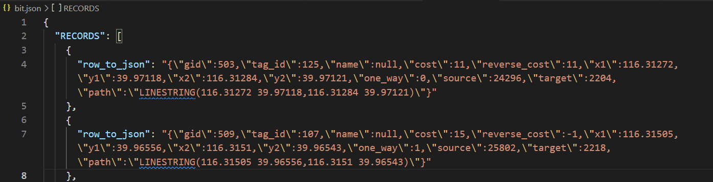

### 安装docker

[Ubuntu Docker 安装 | 菜鸟教程 (runoob.com)](https://www.runoob.com/docker/ubuntu-docker-install.html)

在虚拟机里执行curl自动脚本安装未成功，故按教程执行了手动安装，安装成功。

通过

```
$docker pull postgres:9.3
```

命令在docker安装postgres:9.3镜像

通过

```
$docker run --name mypostgres -e POSTGRES_PASSWORD=postgres -d -p 5432:5432 postgres:9.3
```

命令，运行postgres:9.3容器，映射到虚拟机的5432端口

不会安装postgis镜像，改为拉取postgres 和 gis 组合的镜像，最早支持9.6-2.4版本

```
$docker pull kartoza/postgis:9.6-2.4
```

发现docker的pgrouting镜像[pgrouting/pgrouting Tags | Docker Hub](https://registry.hub.docker.com/r/pgrouting/pgrouting/tags)

直接安装试一试能不能行

```shell
$sudo docker pull pgrouting/pgrouting:latest
```

安装完成，启动命令:

```shell
$sudo docker run --name mypgrouting -e POSTGRES_PASSWORD=pgrouting -p 5432:5432 pgrouting/pgrouting
```

打开navicat连接数据库：配置如下：（Password输入pgrouting），连接成功


下一步：安装osm2pgrouting

```shell
$sudo apt-get install osm2pgrouting
```

下载北京市osm并导入到routing中

地址：https://github.com/xyongcn/BalanceRouting4RealtimeTraffic/tree/master/map

以下osm2pgrouting命令有什么不懂的，可以通过

```shell
$osm2pgrouting --help
```

查询。

新建beijing数据库

输入命令将.osm文件导入数据库：

```shell
$osm2pgrouting -f ./Beijing.osm -c /usr/share/osm2pgrouting/mapconfig.xml -d beijing -U postgres -h localhost -p 5432 -W pgrouting --clean
```

成功


关注点：

- 如何给导出数据添加cost字段？
- 保证导出数据有source和target字段以保证路口。

导出为ways.json的方法在张禹的路况探测开发文档.md里


筛选字段，按gid排序

```sql
select gid, tag_id, name, x1,y1,x2,y2, one_way,source,target,ST_AsText(the_geom) as path from ways
order by gid;
```

筛选出北理附近的区域数据

```sql
select gid, tag_id, name, x1,y1,x2,y2, one_way,source,target,ST_AsText(the_geom) as path from ways
where (x1 between 116.301105 and 116.345737) and (y1 between 39.947291 and 39.971386) 
order by gid;
```

- 左上116.301105,39.971386
- 右下116.345737,39.947291
- 


设置cost和reverse_cost为道路长度，单位为米

```sql
UPDATE ways
SET cost = ST_Length(the_geom::geography), reverse_cost = -1
WHERE oneway = 'YES';

UPDATE ways
SET cost = ST_Length(the_geom::geography), reverse_cost = ST_Length(the_geom::geography)
WHERE oneway = 'UNKNOWN';

UPDATE ways
SET cost = ST_Length(the_geom::geography), reverse_cost = ST_Length(the_geom::geography)
WHERE oneway = 'REVERSED';
```


看看能否显示

​	先转为json导出，cost和reverse_cost四舍五入成整数

```sql
\o /home/ubuntu/桌面/cjz/ways.json

select row_to_json(t)
from (select gid, tag_id, name, round(cost::numeric,0) as cost, round(reverse_cost::numeric,0) as reverse_cost, x1,y1,x2,y2, one_way, source, target, ST_AsText(the_geom) as path from ways where (x1 between 116.301105 and 116.345737) and (y1 between 39.947291 and 39.971386) and (tag_id < 126) order by gid) AS t;
```

​	转为json成功：


点击Export Result导出为json


json格式如下：



写node脚本将json转化为Geohashjson，可在地图中显示：


