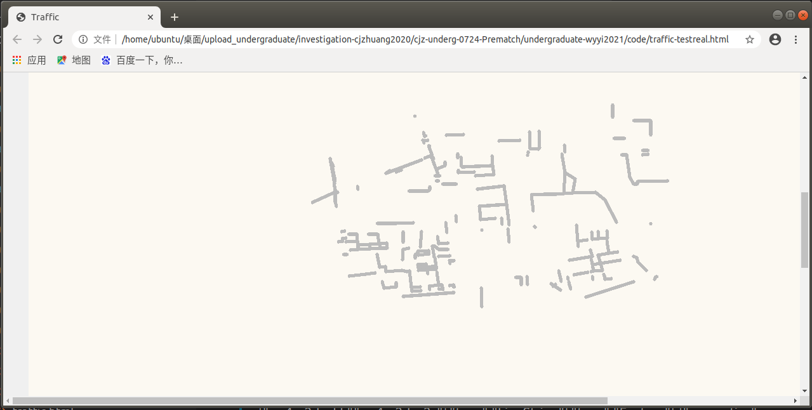
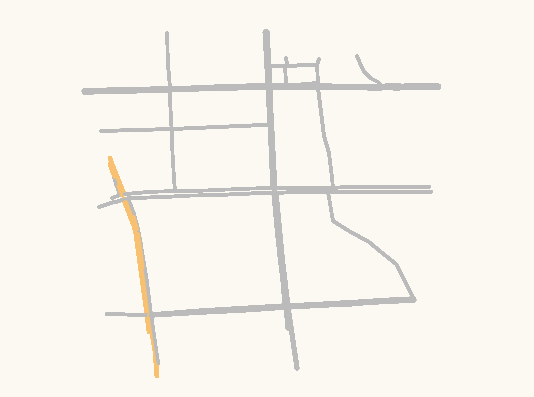

记录一些读音：

α 阿尔法， β 贝塔， γ 伽玛，δ 德尔塔， ε 伊普西隆， ζ 泽塔， η 伊塔， θ 西塔， ι 约塔， κ 卡帕， λ 兰姆达，μ 米欧 ，ν 纽， ξ 克西， ο 欧米克隆， π 派， ρ 柔 ，σ 西格玛， τ 陶 ，υ 玉普西隆， φ 弗爱， χ 凯， ψ 普赛


实现出租车调度的田字格实验：

2021-9-10

先建一个经纬度转geohash和geohash转经纬度的工具页面

经度偏移，东 = +0.04

纬度偏移，南 = -0.04

实现一个自动化工具，生成网状单行道


设计网格道路，

跑起树状区块链，（重新创建一个空链并跑起来）

#### 将地图存到智能合约上


uploadmap_cjz.js模块的结构说明：

```js
//在async function add_map(line)里先执行add_onetype，再执行bind_road_geohash
//调用智能合约的add_onetype，添加一条数据，但是没有绑定到区域上
async function add_oneline(gid, minzoom, cost, oneway, building, highway, name, gtype, path, gas, retry_times) {
	if (retry_times > 10) {
		console.log("add line failed. gid: " + gid);
		return;
	}
	await myContractInstance.add_onetype(gid, minzoom, cost, oneway, building, highway, name, gtype, path, { from: account, gas: gas, position: "w3511111111111", txtime: 278000 }).then(function (result) {
		console.log("gid: ", gid);
		console.log("path: ", path)
	},
		function (err) {
			//retry
			add_oneline(gid, minzoom, cost, oneway, building, highway, name, gtype, path, gas, retry_times + 1);
		});
}


function bind_road_geohash(gid, path) {

	//get areas which has intersection with the road. for lon, 0.01 degree is equal to about 1000m and 1113m for lat
	for (let i = 0; i < path.length; i++) {

		// area_geohash6 = encode_geohash(x,y,6);
		area_geohash5 = path[i].slice(0, 5)
		//  area_geohash4 = encode_geohash(x,y,4);
		// area_geohash3 = encode_geohash(x,y,3);

		//duplicate geohash
		// 如果里面hash值都找的到
		// if((hash_array.indexOf(area_geohash6) != -1) && (hash_array.indexOf(area_geohash5) != -1) && (hash_array.indexOf(area_geohash4) != -1) && (hash_array.indexOf(area_geohash3) != -1)){
		// 	continue;
		// }
		if ((hash_array.indexOf(area_geohash5) != -1)) {
			continue;
		}
		// if(hash_array.indexOf(area_geohash6) == -1){
		// 	hash_array.push(area_geohash6);
		// 	if(has_intersection(path,area_geohash6,6)){
		// 		add_area_line(area_geohash6, gid, 150000, 0);
		// 		console.log("area_geohash6",area_geohash6);
		// 	}
		// }
		if (hash_array.indexOf(area_geohash5) == -1) {
			hash_array.push(area_geohash5);
			add_area_line(area_geohash5, gid, 150000, 0);
			console.log("area_geohash5", area_geohash5);
		}
		// if(hash_array.indexOf(area_geohash4) == -1){
		// 	hash_array.push(area_geohash4);
		// 	if(has_intersection(path,area_geohash4,4)){
		// 		add_area_line(area_geohash4, gid, 150000, 0);
		// 		console.log("area_geohash6",area_geohash4);
		// 	}
		// }
		// if(hash_array.indexOf(area_geohash3) == -1){
		// 	hash_array.push(area_geohash3);
		// 	if(has_intersection(path,area_geohash3,3)){
		// 		add_area_line(area_geohash3, gid, 150000, 0);
		// 		console.log("area_geohash6",area_geohash3);
		// 	}
		// }
	}
}

//区域绑定
function add_area_line(geohash, gid, gas, retry_times) {
	console.log(retry_times);
	if (retry_times > 10) {
		console.log("bind road failed. geohash: " + geohash + " ,gid: " + gid);
		return;
	}
	myContractInstance.add_area_line(geohash, gid, { from: account, gas: gas, position: "w3511111111111", txtime: 278000 }).then(function (result) {
		// console.log(result);
	},
		function (err) {
			console.log(err);
			add_area_line(geohash, gid, gas, retry_times + 1);
		});
}
```


​	董斌的存储方法是将一条一条道路先转成geohash再上传到区块链

​	uploadmap_cjz是把geohash格式的地图传到区块链上


前端显示乘客的需求起止点（蓝色是起点，红色是终点）

交易时一定要有position字段和txttime字段


运行智能合约（√）

#### 实现前后端交互

​	发现前端html文件不能使用require，导致提供eth.getAccountsByRegion的文件暂时用不了，需要时间解决

​	修改node_modules/web3/node_modules/web3-eth/lib/index.js 加入新方法，尝试编译之后引用，看是否能用

​	需要安装开发依赖dtslint等（最后直接修改了dist文件里的web3.min.js支持了树状区块链接口）

创建单个和多个车辆的账户（创建了两个车辆账户，按区域调度没问题）

设计虚拟车辆轨迹（√）

前端显示每个功能点


#### 9/14——9/21实现道路轨迹规划

分为车乘匹配和路径规划两部分，目前先考虑车乘匹配成功后的路径规划问题

路径规划算法

 1. Dijkstra算法：广度优先搜索，最简单的寻路算法，寻找到所有节点的最短路径，用途冗余。

 2. JPS算法：适用于在有障碍物的二维平面空间上寻路，针对遇到障碍物的情况进行了算法性能优化，不适用于交通道路规划。

 3. A*算法：不但记录其到源点的代价，还计算当前点到目标点的期望代价，是一种启发式算法，可以着手

     1. 欧几里得距离（需要勾股定理，计算量较大，费力不讨好）

     2. 曼哈顿距离，一般都采用曼哈顿距离

        

        张海亮优化思路：比较中间点的geohash字符串，前缀和终点匹配的越长距离越短，或者前缀相同时，字符串中的字母优先级越大的距离越短

        

        ​							

        缺点：没有考虑边界条件，比如前缀匹配是3个字母的不一定距离就比前缀匹配是4个字母的远,	而且具体的对比细节没有讲清楚，不到位

        改进：比较距离时，将两个字符串相同的前缀裁剪掉，比较剩余不同部分的横竖格子数量（可调整大小），作为权值

    【参考文献】：

    ​	[1]张海亮, 张征. 基于GeoHash索引的A^(*)算法优化[J]. 火力与指挥控制, 46(6):6.

    ​	[2] Wang C ,  Wang L ,  Qin J , et al. Path planning of automated guided vehicles based on improved A-Star algorithm[C]// IEEE International Conference on Information & Automation. IEEE, 2015:2071-2076.

    ​	https://dinojs.github.io/pathfinding/

    ​	https://github.com/royhobbstn/contraction-hierarchy-js

**道路规划实现过程**

前端通过智能合约调用get_types返回的result（元素均为数组）结构说明：

- **result[0]：**roadInfo，result[0]每四个代表一个道路的信息，其中1是gid，2是minzoom值，3代表是否oneway，4代表是否building

- **result[1]：**roadName，记录每条道路的name

- **result[2]：**roadHighway，记录每条道路的highway类型

- **result[3]：**roadGtype，记录每条道路的line_json.geometry.type

- **result[4]：**roadPath，记录每条道路的所有coordinates，并在头儿起记录coordinates的个数，用一维数组的形式记录

**GetOneline函数 **是根据五位geohash区域获得改区域内所有road（一条一条的）

**ChangeJSON函数** 是将获取到的road转换成可以直接在地图展示的map_data对象

前端处理result的流程说明（getRoads.js）：

``` js
var init_data = [{"type":"FeatureCollection","totalFeatures":0,"features":[],"crs":null},{"crs":{"properties":{"name":"urn:ogc:def:crs:EPSG::4326"},"type":"name"},"features":[],"totalFeatures":0,"type":"FeatureCollection"}];
```

按流程处理并填充init_data

然后改变map_data

map_data = JSON.stringify(init_data);
map_data = JSON.parse(map_data);

然后执行update_map();


区块链智能合约的地图存储结构分析：

	// 通过geohash找到对应的area
	mapping(bytes32 =>  area_types) public geo_maps;
	//num的数值就代表存了多少条道路
	//通过i从0到num遍历area_types里的types_list得到所有gid
	//uint num = geo_maps[hash].num;
	//gid = geo_maps[hash].types_list[i]; 
	struct area_types{
	    uint num;
	    // num->gid,store gids of roads in the area
	    mapping(uint => uint) types_list;
	}


​	//以下是举例如何通过geohash查找到所有道路的gid
​	uint num = geo_maps[hash].num;
​	for(i=0; i < num; i++){
​	    gid = geo_maps[hash].types_list[i]; 
​					
​	//gid->one_type,通过gid找到真正的一段路，gid就是上传时的counter，代表一整条路
​	mapping(uint => one_type) types;
​	
​	// 存储地图信息
​	struct one_type
​	{	
​	    int32 minzoom;
​	    bool  oneway;  
​	    bool  building; 
​	    bytes32 highway;
​	    bytes32 name;   //名称 
​	    bytes32 gtype;
​	    uint path_num;	
​	    mapping(uint => bytes32) path;
​	}


**A*算法的工程结构解析：**

1. geojson.js文件里将从basic.geojson里读取的对象当作filedata变量输入，然后通过 _cleanseGeoJsonNetwork函数将features里的道路进行最短路径预处理，然后调用addEdge.js的 _addEdge方法添加边（coordinates被表示成了geometry），对外暴露 _loadFromGeoJson构造函数

2. 在Graph的构造函数里定义了空对象  _ nodeToIndexLookup等来支持node坐标点和index下标的转换，_currentNodeIndex或许可以用gid来替代为道路的唯一标识

3. addEdge.js第53行**解决了记录路口邻居的问题（重要）**

   1. 在Graph类初始化时有adjacency_list数组
   2. 邻居节点数组通过this.adjacency_list[start_node_index].push(obj);记录当前坐标所有连接到的道路（obj）的末尾坐标和该道路的耗时（cost），如果是第一次记就写成this.adjacency_list[start_node_index] = [obj];

4.  main.js里主要是定义了Graph构造函数

5. 在example.js里通过调用graph.contractGraph();建立层次结构

   

先把cost地图直接展示在网页上的工作做好，然后再处理上传工具和智能合约格式适配的问题

设计道路的cost值：暂定从西到东，cost从1开始逐个加1，因此**车辆选择路径的时候会优先选择南北方向**，cost属性是properties对象的子属性


遇到问题：网状道路的纬度纠偏？根据等差纬度变化生成的网格竖线的三个点，其实际距离并不均匀

解决：实际上是自己的纬度等差写错了，改了就好了


遇到问题：从区块链扒下来的道路数据会有重复的

解决：在getRoads.js文件里加入gidList记录gid用来去重

注意：使用indexOf时最好别用！运算符，！-1的结果是false，并不是true


9-20完成道路的去重和路口邻居道路的邻居记录工作，下面开始实现A*算法

实现曼哈顿公式（dislat+dislon）用前缀匹配优化

曼哈顿公式原理：

f(j) = g(j) + h(j)，

- f(j)为当前节点估计值，估计值越小的节点开销越小，越优先被选择
- g(j)是从起点到当前节点j的实际费用的量度
- h(j)是从节点j到终点的最小费用的估计，h(j)要满足一个要求：不能高于节点 j 到终点的实际最小费用，为了减小计算量，设计h(j)函数采用曼哈顿距离，于是整个公式变为：**f(j)=g(j)+(|Ax-Bx|+|Ay-By|) * P**，这里为了进一步减小计算量，x和y用geohash格子表示，其中**格子的大小**和**参数P**都可以调节。
- 从起始节点点向目的节点搜索时，每次都搜索f(j)最小的节点，直到发现目的节点。

```js
manhattan = (a, b) => {
    //Heuristic - Manhattan distance
    const graph = this.state.graph;

    return (
      Math.abs(graph[a].lon - graph[b].lon) +
      Math.abs(graph[a].lat - graph[b].lat)
    );
  };
```


1. 搞清楚distance的geohash块对应的长宽（√）
   1. 因为一个Base32编码的元素需要5位长的二进制串来表示，所以10位geohash的二进制串长度为50，需要10*5双重循环来遍历每一个二进制值，通过even来区分当前值是经度还是纬度对应的二进制值
   2. 10位长的geohash串对应                                                                                                                                                                                                                                                                                                                                                                                                                                                                                                                                                                                                                                                                                                                                                                                                                                                                                                                                                                                                                                                                                                                                                                    长宽大概是1m
   3. 可以通过调整geohash.length来区分不同规模的数块（重要调参）
2. 搞清楚曼哈顿距离的正确性（√）
   1. 会不会出现短视？比如走了（2->5->5->5）而不走（7->1->1->1）
      - 不会，if (newCost < costSofar.get(next.end))会通过costSofar.set(next.end, newCost)来用较小的花费覆盖之前搜索到的大花费

**9-21完成路径规划模块的开发：**

getRoads.js文件从区块链获取道路数据并构建路口邻居查询表adjacencyList

```js
/*getRoads.js*/
//记录十字路口
let adjacencyList = {}
//记录gid用来去重
let gidList = []
```

a-star-search.js文件里实现A*算法主逻辑，将规划好的道路用蓝色路径标注在地图上


董斌的地图存储是bytecode，需要转换成基于字符串的存储

（好像可以有方法直接在智能合约上以bytes32的形式操作字符串）

遇到问题：在remix调试的时候将“wx4er”字符串直接当作bytes32变量输入发生错误。

​	原因：bytes32是定长类型，输入时只能输入64位长的16进制数，所以输入五位长的字符串会发生错误。


#### 智能合约路径规划功能设计：

1. 首先在上传地图的时候，在地图存储合约StoreMap.sol里生成邻居节点查询列表

   ```js
   //-----------------cjz--------------------------------------------------
       //每个邻居节点的结构
       struct adj
   	{	
   	    bytes32 end;
   		int32 cost;
   		uint gid;
   	}
   	//遍历邻居列表能够找到所有邻居
   	struct adj_types{
   	    uint adjnum;
   	    mapping (uint => adj) adjs;
   	}
       //通过路口geohash找到其邻居列表
       mapping(bytes32 =>  adj_types) public adjacencyList;
   //-----------------cjz--------------------------------------------------
   
   
   
   //存储邻居节点的逻辑
   bytes32 startNode = path[0];
   bytes32 endNode = path[path.length - 1];
   
   adj storage single_adj = types[gid];
   
   uint adjnum = adjacencyList[startNode].adjnum++;
   adjacencyList[startNode].adjs[adjnum].end = endNode;
   adjacencyList[startNode].adjs[adjnum].cost = cost;
   adjacencyList[startNode].adjs[adjnum].gid = gid;
   ```

   

2. StoreMap.sol里的所有geohash以bytes32的形式存储，在astar算法的智能合约里再酌情转为string进行操作

   1. 遇到问题：solidity不支持优先队列，需要自己实现，需要支持push和pop

   2. 实现的优先队列数据结构，**逻辑为cost—>geohash(string类型)**：支持enqueue、dequeue、自动按cost从小到大排序、判断是否为空，但是不能通过索引访问（这一点项目中用不到所以没做），先用uint测试，再用string测试，最后将输入类型改为bytes32，bytes32在manhattan函数中通过sliceGeohash统一裁剪为10位长度。

      ```js
      //实现优先队列
          struct Heap {
              uint256[] costs;
              mapping(uint256 => bytes32) map;
          }
          //唯一实例
          Heap frontier;
          //判断是否为空
          modifier notEmpty() {
              require(frontier.costs.length > 1);
              _;
          }
          //获得头元素
          function top() public view notEmpty() returns(uint256) {
              return frontier.costs[1];
          }
          //出队（直接删除无返回值）
          function dequeue() public notEmpty() {
              require(frontier.costs.length > 1);
              
              uint256 toReturn = top();
              frontier.costs[1] = frontier.costs[frontier.costs.length - 1];
              frontier.costs.pop();
      
              uint256 i = 1;
      
              while (i * 2 < frontier.costs.length) {
                  uint256 j = i * 2;
      
                  if (j + 1 < frontier.costs.length)
                      if (frontier.costs[j] > frontier.costs[j + 1]) 
                          j++;
                  
                  if (frontier.costs[i] < frontier.costs[j])
                      break;
                  
                  (frontier.costs[i], frontier.costs[j]) = (frontier.costs[j], frontier.costs[i]);
                  i = j;
              }
              delete frontier.map[toReturn];
          }
          //入队
          function enqueue(bytes32 geohash, uint256 cost) public {
              if (frontier.costs.length == 0) 
                  frontier.costs.push(0); // initialize
              
              frontier.costs.push(cost);
              uint256 i = frontier.costs.length - 1;
      
              while (i > 1 && frontier.costs[i / 2] > frontier.costs[i]) {
                  (frontier.costs[i / 2], frontier.costs[i]) = (cost, frontier.costs[i / 2]);
                  i /= 2;
              }
      
              frontier.map[cost] = geohash;
          }
      ```

   3. 测试并验证——getLatBlock和getLonBlock在智能合约中的计算结果和JS中的计算结果相同（√）

   4. **遇到问题：**从sliceGeoHash返回的裁剪后的字符串，在remix ide看起来是正确的，但使用其继续进行计算的结果却不正确，目前猜测是返回的值肯定有隐藏乱码，**解决：**是dif = PRECISION - index + 1错了，不应该+1，导致返回的短串有不可见冗余。至此manhattan函数调试完毕

   5. **遇到问题：**是因为传入的数据不能为uint产生的报错

      ```js
      add_onetype err:  Error: VM Exception while processing transaction: revert
          at Object.InvalidResponse (/home/ubuntu/桌面/upload_undergraduate/cjz_underg_2021_09/tree_blockchain/node_modules/truffle-contract/node_modules/web3/lib/web3/errors.js:35:16)
      ```
      
      
      
   6. **遇到问题：**究其原因，是html文件引入的智能合约StoreMap.js文件里的ABI忘了改，而且，改变区块链数据的操作需要加上.call({from: mapContractAccount, gas: 500000})，然后再.then

      

   7. **遇到问题：**需要的gas较大，超过了blockchain limit，需要修改区块链的gas上限（此问题不存在）。

   8. **遇到问题：**invalid opcode，会不会是因为上传地图的时候没有ascii，然后根据区域查询的时候才ascii，这是两种bytes32数据？

   9. **遇到问题：**为什么一用for循环就invalid opcode？目前锁定问题出现在返回的bytes[] memory数组赋值两个及以上就会出现这个问题。解决：返回值中如果有数组必须初始化长度，back = new bytes32[](adjNodes.adjnum)

   10. 修改ganache-cli账户的以太币数量：ganache-cli -e 100000000 -l 1000000000000

   11. 绷不住了，询问老师建议：1.用最简单的九宫格地图做实验。2.实现专门的测试，测试mapping操作的gas消费是多少，查手册解决映射处理和gas问题

   12. **遇到问题：**处理paths->incalid opcode，解决：paths记录的顺序搞错了，已解决。

   13. **遇到问题：**处理adjacencyList->out of gas

   14. 先试验一条路（1x1）上能否运行算法：改成1x1的地图，仍然out of gas，

       1. 计算gas和ETH个数的关系：
          1. 1gas == 20gwei
          2. 1ETH == 1e9gwei
          3. 于是1ETH == 5e7gas，即5千万gas就是1个ETH
          4. 每个测试账户有100ETH，即有50亿gas
          5. gas limit: 6721975（gas limit是什么意思？）
       2. 单独写个测试查看操作mapping的gas：
          1. 添加：80000000（8千万gas，这个应该是账户提供了这么多，实际只消耗了68364gas）transaction cost: 68364 gas
          2. 添加+删除：80000000（8千万gas） transaction cost: 55490 gas

   15. 再实验（2x2）上能否运行算法

   16. **Manhattan函数在两个参数相同时会out of gas**（分区测试->缩小范围->整理逻辑->定位问题->排查问题、边界条件测试），解决：加if判断，两参数相等时返回0。简单测试之后，不再出现out of gas的报错。

   17. 在对角格子上可以实现路径规划，花费为5500000gas。

   18. 在3x3，4x4网格道路上实现路径规划，花费在1e7-1e8 gas之间，结果正确，支持一次部署多次调用。

   

3. 返回给前端的结果为规划好的路口geohash数组

4. solidity是**图灵完备**的，即一切可计算的问题都可以计算

实现系统流程，提出需求，解决乘客需求

区域状态

账户位置

信誉值

车载自组网理论条件充足，可以建设去中心化app——出租车调度系统

张禹工作分析：

​	**智能合约**代码结构：

​	StoreTraffic.sol

```js
//添加路况
function add_traffic(uint road_id, uint speed, uint seq, uint date){
		uint pre_seq  = traffics[road_id].seq;
		uint pre_date = traffics[road_id].date;
		
		uint counter;
		//第一次路况
		if(pre_date == 0){
			//添加到本地路况
			counter = traffics[road_id].local_traffic.counter;
			traffics[road_id].local_traffic.tmp_speed[counter++] = speed;
			traffics[road_id].seq = seq;
			traffics[road_id].date = date;
			traffics[road_id].speed;
		}
		//路况比当前路况新
		else if(date > pre_date || date == pre_date && seq > pre_seq){
			//对前一个时间段的路况进行汇总更新
			aggregate_traffic(road_id);
			//平滑并更新路况
			smooth_traffic(road_id, speed, pre_seq, seq, pre_date, date);
			//添加到本地路况
			traffics[road_id].local_traffic.tmp_speed[0] = speed;
			traffics[road_id].local_traffic.counter++;
		}
		//允许早两个时间段的路况提交
		else if(date == pre_date && pre_seq - seq <= 2){
			//添加到本地路况
			counter = traffics[road_id].local_traffic.counter;
			traffics[road_id].local_traffic.tmp_speed[counter++] = speed;
			//本地路况数量大于阈值，汇总路况并更新
			if(counter > max_threshold){
				aggregate_traffic(road_id);
			}
			//平滑并更新路况
			else{
				smooth_traffic(road_id, speed, pre_seq, seq, pre_date, date);
			}
		}
    }
}
//对前一个时间段的路况进行汇总更新
function aggregate_traffic(uint road_id){
		//对所有速度进行排序并取中位数
		uint counter = traffics[road_id].local_traffic.counter;
		if(counter >= min_threshold){
			uint temp;
            //插入排序，从小到大
			for(int32 i=0; i< int32(counter); i++){
				temp = traffics[road_id].local_traffic.tmp_speed[uint(i)];
				int32 j= i-1;
				while(j>-1 && temp < traffics[road_id].local_traffic.tmp_speed[uint(j)]){
					traffics[road_id].local_traffic.tmp_speed[uint(j+1)] = traffics[road_id].local_traffic.tmp_speed[uint(j)];
					j--;
				}
				traffics[road_id].local_traffic.tmp_speed[uint(j+1)] = temp;
			}
		}
		traffics[road_id].speed = traffics[road_id].speed * (100-aggregate_alpha)/ 100 + 
			traffics[road_id].local_traffic.tmp_speed[counter/2] * aggregate_alpha/ 100;
			
		//清空临时路况	
		traffics[road_id].local_traffic.counter = 0;
	}
//平滑并更新路况
function smooth_traffic(uint road_id, uint speed, uint pre_seq, uint seq, uint pre_date, uint date){
		if(speed > max_speed){
			return;
		}
		uint diff_seq = 0;
		uint alpha;
    	//同一天不同时段
		if(pre_date == date){
			diff_seq = (seq - pre_seq)>0 ? seq-pre_seq : pre_seq - seq;
			alpha = smooth_delta + smooth_delta* diff_seq;
		}
 		//不是同一天
		else if(date - pre_date ==1){
			diff_seq = seq + max_seq - pre_seq;
			alpha = smooth_delta + smooth_delta* diff_seq;
		}
		else{
			alpha = 100;
		}
		//更新路况信息
		traffics[road_id].seq = seq;
		traffics[road_id].date = date;
		traffics[road_id].speed = traffics[road_id].speed * (100- alpha)/ 100 + speed * alpha/ 100;
		
	}

```


文献阅读：

《Geohash 编码在出租车巡游路线推荐中的应用》利用geohash划分区域，实时预测空载出租车司机行驶过程中周边区域待打车乘客数量，在出租车司机到达每个路口前向司机推荐下一个最优的行驶路段。

《自动驾驶出租车调度系统研究综述》自动驾驶出租车调度模型的关键技术是处理好订单分配和路径规划的问题,然后以此为基础,在时间和空间上对全局需求分布做进一步的优化.K

​	第 ２ 节概括了调度系统的整体建模问题;第 ３ 节讨论了构建自动驾驶出租车调度系统的关键技术问题;第 ４ 节指出了基于大数据和车联网的调度系统的研究方向和发展趋势

​	司乘最优匹配方案

​	通过分析城市路网实时需求 信息做出判断并向欠饱和状态地区派遣出租车

​	基于实时信息和交通 流量的多元数据,提出了一种针对多辆出租车的协同调度算 法,实现了最佳驾驶线路和预期收入

​	通过精确预算算法处理司乘匹配约束,有效提高了出租车的利用率

​	以最大化 乘客服务数量为主要目标,以乘客需求的等待时间和费用为 约束条件,建立了调度模型

​	Liu 等[２ ８]在需求生成、出租车分配 操作、实时动态路径规划 ３ 个方面构建了自动驾驶出租车调 度模型，并对 比分析了实时数据和 历史数据对调度策略的影响.

​	大部分研究欠缺对合乘共享绕路问题的细分和考虑，有的研究缺乏考虑路网交通流量的动态变化，使仿真结果产生过高或过低优化的假象

​	设计吸引乘客的合乘机制、制定合理的乘车安排、**建立在线系统中匹配机制与未知乘客的信任（信誉值）**[４０]是共享调度系统的 ３ 个关键技术

​	在静态和确定性调度中,所有的输入都是事先已知的,路 径规划执行后也不会发生改变.然而,在真实的交通运营环 境中,出租车调度面对更多的是动态、时变的问题,按部就班 套用静态路径规划无法优化动态问题,且冗余的车辆增派将增加路面交通压力.面对部分甚至全部输入是未知的动态交 通环境,路径在设计和执行期间需要考虑来自各方面随机变量的影响

​	空车调配不当会造成不同路网中的车辆分配不平衡,进而影响乘客的使用需求

​	Yu 等[６ ８]根据马尔可夫决策过程制定空载出租车最佳路线

​	Gao 等[７ ０] 提出两种解决空车调度的方法,一种是基于排队理论,根据乘 客需求使出租车路径参照环境状态来更新的模型,另一种是无模型的学习方法,出租车从观察到的轨迹数据中学习并得出最佳的决策.

​	**real-time information** and **historical information**


做成一个分布式系统的话，如何利用分布式系统的优点？（安全、终端计算）如何查找相关工作？安全——司机和平台都不能知道所有数据，限制平台的权力（很有必要，避免垄断），不能知道跟自己无关的数据，保证了安全性，隐私不被侵犯，

分布式的合理性在于，提交需求，然后合约负责在类似五公里范围内的边缘计算

感觉目前是在用分布式工具做一个中心化服务？


道路通行时间是否有现成的信息参考？路况信息要做静态的还是动态的？更新路况？

先做静态的，再说下一步，两条双行道+路口。


信誉值系统的加入，看一下乘客和司机能挂钩哪种信誉

目前只想到可以跟拒单率挂钩，这样以来可否能从**载客率**或者**平均载客时间**来进行衡量？相关研究有待寻找

如何在模拟的网格数据中初始化路况？目前网格信息只是单行道，缺少双行道和路口。


《[一种机场出租车优先级的调度方法](https://www.zhangqiaokeyan.com/patent-detail/06120104155632.html)》本发明用Kmeans聚类分析方法,对出租车进行里程等级评定,然后根据司机守法度,诚信度,熟练度和友善度四个指标来反映司机信誉度,结合两者对出租车优先级进行评定,并由出租车优先级设计优先安排方案,给某些短途载客再次返回的出租车一定的"优先权",以均衡这些出租车的收益.


工作就按既定的来，不要再犹犹豫豫的

向老师是世间少有的非常有耐心的老师，每周多做一点工作就可以增添互相的信任


行胜于言

感谢老师包容我一而再再而三的犯错误

把工作态度，从试图一开始就规划好一切，避开一切错误，改成，首要完成既定工作，其次阅读文献寻找理论依据和优化方向。


**先把**双行道改为单行道，搞明白张禹的虚拟路口到底怎么回事，就是引入了路口的抽象概念，实际数据结构并没有路口

​	导入的表中保留有one_way字段（0-未知,1-单向,2-双向,-1-单向但是几何上方向是相反的）

​	先搞懂双行道的生成办法

​	经典的十字路口由四条双行道数据组成，两个source两个target

​	如何改成单行道呢？

​	找到董斌小数据里的双行道，观察geohash值


​	路口的数据并不是连贯的，也就是不能只根据道路结尾的坐标点直接索引到其邻居道路。

```js
//小数据北侧竖向大双行道
	//左边
{"properties":{"minzoom":9,"highway":"secondary","osm_id":27572729,"name":"������·","oneway":"yes"},"geometry":{"coordinates":["wx4er5e6z9e","wx4er5e6rg0","wx4er57w94n","wx4er57ed37","wx4er4gu8p3","wx4er4efgz9","wx4er47vwn3","wx4er4hnbvt","wx4er1u4nm7"],"type":"LineString"},"type":"Feature"},
    //右边
{"properties":{"minzoom":9,"highway":"secondary","osm_id":167651454,"name":"������·","oneway":"yes"},"geometry":{"coordinates":["wx4er1u64x5","wx4er4hnt4j","wx4er4k0uhk","wx4er4egp9v","wx4er55v0wn","wx4er5edg6x"],"type":"LineString"},"type":"Feature"},
//小数据南侧竖向大双行道
    //左边
{"properties":{"minzoom":9,"highway":"secondary","osm_id":167651447,"name":"������·","oneway":"yes"},"geometry":{"coordinates":["wx4er1u1w9s","wx4er1kr5bn","wx4er1heg09","wx4er0uwnt1","wx4er0ug12f"],"type":"LineString"},"type":"Feature"}
    //右边
{"properties":{"minzoom":9,"highway":"secondary","osm_id":167651449,"name":"������·","oneway":"yes"},"geometry":{"coordinates":["wx4er0ugjvr","wx4er0uy5qw","wx4er1hxq34","wx4er1hxwj7","wx4er1kdhrz","wx4er1ksffg","wx4er1u3dgs"],"type":"LineString"},"type":"Feature"},
//小数据横向大双行道
    //下边
{"properties":{"minzoom":9,"highway":"secondary","osm_id":139339318,"name":"ѧԺ��·","oneway":"yes"},"geometry":{"coordinates":["wx4eqcet93y","wx4eqcetmm9","wx4eqcev2zh","wx4eqcwwgkt","wx4eqcwzpdz","wx4er1c82c7","wx4er1fcn8q","wx4er1u1w9s","wx4er1u3dgs","wx4er1zg5kb","wx4er3b73kq","wx4er3be2zq","wx4er3ceywu","wx4er3ujp4k"],"type":"LineString"},"type":"Feature"},
    //上边
{"properties":{"minzoom":9,"highway":"secondary","osm_id":219487085,"name":"ѧԺ��·","oneway":"yes"},"geometry":{"coordinates":["wx4er3ujw8g","wx4er3csqx6","wx4er3b7gvm","wx4er1zgdyr","wx4er1u64x5","wx4er1u4nm7","wx4er1g1sn2","wx4eqcxrv3v","wx4eqcwzxd9","wx4eqcevbtr","wx4eqcetv48"],"type":"LineString"},"type":"Feature"},
    
//两个secondary_link
{"properties":{"name":"urn:ogc:def:crs:EPSG::4326"},"type":"name"},"features":[{"properties":{"minzoom":9,"highway":"secondary_link","osm_id":42399576,"oneway":"yes"},"geometry":{"coordinates":["wx4er1u4nm7","wx4er1u1w9s"],"type":"LineString"},"type":"Feature"}
        
{"properties":{"minzoom":9,"highway":"secondary_link","osm_id":46032948,"oneway":"yes"}
    
```

​	存在highway类型为secondary_link的数据，但其并没有在现有的地图中显示出来，搞懂一下这个东西的意义：

​		先观察coordinates的geohash坐标：

​			

​	双行道拆分成两个单行道，两个单行道的点没有一样的，只是离的很近而已，末尾3—5位不一样，标的顺序也是相反的

​	观察路段数据的source和target，根据source或者target相连的道路，其相连性是否也可以通过path的起点和终点判断？

​	

```js
{"gid":43136,"class_id":110,"name":"","x1":116.63407,"y1":39.91642,"x2":116.63525,"y2":39.91732,"one_way":0,"source":58906,"target":11577,"path":"(116.63407 39.91642,116.63417 39.91654,116.63525 39.91732)"}

{"gid":43895,"class_id":108,"name":"东环南路","x1":116.5434,"y1":39.77184,"x2":116.54107,"y2":39.77473,"one_way":0,"source":43136,"target":55024,"path":"(116.5434 39.77184,116.54107 39.77473)"}

 {"gid":65640,"class_id":109,"name":"兴业街","x1":116.5434,"y1":39.77184,"x2":116.53843,"y2":39.76942,"one_way":0,"source":43136,"target":63398,"path":"(116.5434 39.77184,116.53843 39.76942)"}

 {"gid":64,"class_id":108,"name":"东环南路","x1":116.54667,"y1":39.76802,"x2":116.5434,"y2":39.77184,"one_way":0,"source":22853,"target":43136,"path":"(116.54667 39.76802,116.5434 39.77184)"}

 {"gid":58906,"class_id":109,"name":"北环东路","x1":116.49656,"y1":39.80591,"x2":116.49834,"y2":39.8067,"one_way":0,"source":31105,"target":15937,"path":"(116.49656 39.80591,116.49834 39.8067)"}

 {"gid":11577,"class_id":123,"name":"","x1":116.75312,"y1":39.90567,"x2":116.72976,"y2":39.91492,"one_way":0,"source":5374,"target":34144,"path":"(116.75312 39.90567,116.75267 39.90591,116.75236 39.90606,116.75208 39.9061,116.75117 39.90616,116.75083 39.90624,116.75039 39.90646,116.74947 39.90713,116.74834 39.90785,116.74667 39.90878,116.74466 39.9099,116.74227 39.91157,116.74108 39.9122,116.7403 39.91257,116.7391 39.91306,116.73781 39.91341,116.72976 39.91492)"}

//把东环南路六条数据全找出来
 {"gid":64,"class_id":108,"name":"东环南路","x1":116.54667,"y1":39.76802,"x2":116.5434,"y2":39.77184,"one_way":0,"source":22853,"target":43136,"path":"(116.54667 39.76802,116.5434 39.77184)"}

 {"gid":43895,"class_id":108,"name":"东环南路","x1":116.5434,"y1":39.77184,"x2":116.54107,"y2":39.77473,"one_way":0,"source":43136,"target":55024,"path":"(116.5434 39.77184,116.54107 39.77473)"}

 {"gid":77160,"class_id":108,"name":"东环南路","x1":116.54107,"y1":39.77473,"x2":116.54048,"y2":39.77531,"one_way":0,"source":55024,"target":48672,"path":"(116.54107 39.77473,116.54048 39.77531)"}

 {"gid":39267,"class_id":108,"name":"东环南路","x1":116.54048,"y1":39.77531,"x2":116.53684,"y2":39.77861,"one_way":0,"source":48672,"target":12089,"path":"(116.54048 39.77531,116.53684 39.77861)"}

 {"gid":71688,"class_id":108,"name":"东环南路","x1":116.53684,"y1":39.77861,"x2":116.53154,"y2":39.78273,"one_way":0,"source":12089,"target":45062,"path":"(116.53684 39.77861,116.53154 39.78273)"}

 {"gid":82647,"class_id":108,"name":"东环南路","x1":116.53154,"y1":39.78273,"x2":116.52805,"y2":39.78616,"one_way":0,"source":45062,"target":1107,"path":"(116.53154 39.78273,116.52805 39.78616)"}

//根据source和target找到东环南路中间连着的路
 {"gid":65640,"class_id":109,"name":"兴业街","x1":116.5434,"y1":39.77184,"x2":116.53843,"y2":39.76942,"one_way":0,"source":43136,"target":63398,"path":"(116.5434 39.77184,116.53843 39.76942)"}

 {"gid":11391,"class_id":108,"name":"Donghuan Zhonglu","x1":116.54107,"y1":39.77473,"x2":116.54226,"y2":39.77713,"one_way":0,"source":55024,"target":5940,"path":"(116.54107 39.77473,116.54178 39.77487,116.54199 39.77496,116.54208 39.77505,116.54211 39.77514,116.54208 39.77554,116.54209 39.77576,116.54226 39.77713)"}

 {"gid":70034,"class_id":109,"name":"康定街","x1":116.53476,"y1":39.77252,"x2":116.54048,"y2":39.77531,"one_way":0,"source":23496,"target":48672,"path":"(116.53476 39.77252,116.54048 39.77531)"}

 {"gid":33473,"class_id":109,"name":"建安街","x1":116.53502,"y1":39.77774,"x2":116.53684,"y2":39.77861,"one_way":0,"source":14777,"target":12089,"path":"(116.53502 39.77774,116.53684 39.77861)"}

 {"gid":69981,"class_id":109,"name":"景园街","x1":116.52932,"y1":39.78161,"x2":116.53154,"y2":39.78273,"one_way":0,"source":62593,"target":45062,"path":"(116.52932 39.78161,116.53154 39.78273)"}

 {"gid":75395,"class_id":108,"name":"荣昌东街","x1":116.52493,"y1":39.78466,"x2":116.52805,"y2":39.78616,"one_way":1,"source":38944,"target":1107,"path":"(116.52493 39.78466,116.52805 39.78616)"}

 {"gid":86174,"class_id":108,"name":"东环中路","x1":116.52784,"y1":39.78638,"x2":116.52805,"y2":39.78616,"one_way":0,"source":41498,"target":1107,"path":"(116.52784 39.78638,116.52805 39.78616)"}
```

​	找找周畅的数据格式是否能在路口找到邻居（这条路在路口与其邻居并不是连续的，有两个解决办法，一个是用geohash找范围内绑定好的邻居，另一个是通过source和当前道路target相同来找邻居）


​	通过截取道路尾部单个geohash的方法，选出一个格子，考察其中绑定的道路，从中找到邻居道路，此方法同样欠妥，因为会出现上图中这种路口包含不全面的情况。


通过算法遍历道路末尾七位geohash的八个邻居块，可以解决单个七位geohash块对路口覆盖不全的问题，同时，并没有直接去考察六位geohash块，在解决问题的同时减少了需要考察的数据量，优化了准确度和性能。

如果找不到，想想怎么在真实的数据中记录邻居

​	在真实的数据中应用astar算法

​		写一个工具，筛选出一个geohash块内所有的primary和secondary道路，查看效果（×）。先确定geohash块的长度（wx4er五位），

​		**发现问题：**现有的静态地理数据没有cost字段，无法进行导航预测，先不用真实数据

​		**解决：**先模拟真实数据实现虚拟的双行道，加上虚拟的cost，让算法支持双行道。

​		双行道拆分为单行道的直观理解：


​		数格子举例子的时候可以用这个网站[geohash在线](http://www.geohash.cn/)

​		但是十字路口不都是联通的，遇到不连通的情况就得通过geohash匹配

​		条件：上传地图的时候进行道路绑定，如果十字路口当前道路邻居小于3个就启用范围匹配算法，如果大于等于3个就直接用绑定的数据

​		先做一个双行道数据的demo

​		然后在其上把系统跑起来

​		自动化一下

​		然后翻看一些信誉值的论文

​		看一下张禹是怎么处理路口的，直接找traffic相关工作，引用的什么文件，到了路口（intersection）的时候怎么处理的

​	实现多车一对一 自动化运行

​	找一找描写信誉值的论文

​	

**再**看看地图的数据结构，是否能加上路口这一概念（没有路口这个数据结构）

**再**实现多车乘调度以及自动化运行的工作

**提示：**论文写补充工作的时候可以写未来可以补充支持掉头的算法

1. 先做好静态路况工作，添加双行道等数据格式并使寻路算法支持
2. 进行文献调研，参考利用信誉值或者路况的相关研究（可以先实现虚拟的信誉值计算，让其能基本支持车辆筛选工作）
3. 路口信息在地图上的表示和获取方法：要按地图标准格式来处理；
4. 细化之后的工作
5. 乘客、车辆、起止点位置在前端按顺序自动化进行


分析gid数据道路的连通性：

```js
 {"gid":19679,"class_id":108,"name":"大柳树路","x1":116.32924,"y1":39.95435,"x2":116.32982,"y2":39.95092,"one_way":1,"source":1722,"target":47299,"path":"(116.32924 39.95435,116.32955 39.95242,116.3297 39.95146,116.32982 39.95092)"}

//source相同的
 {"gid":39193,"class_id":110,"name":"大慧寺西一街","x1":116.32924,"y1":39.95435,"x2":116.32552,"y2":39.95419,"one_way":1,"source":1722,"target":44032,"path":"(116.32924 39.95435,116.32552 39.95419)"}

//target相同的
 {"gid":19678,"class_id":109,"name":"大慧寺路","x1":116.32626,"y1":39.95071,"x2":116.32982,"y2":39.95092,"one_way":0,"source":28851,"target":47299,"path":"(116.32626 39.95071,116.32827 39.95083,116.32862 39.95085,116.32982 39.95092)"}

 {"gid":19680,"class_id":108,"name":"皂君庙路","x1":116.32919,"y1":39.95628,"x2":116.32895,"y2":39.9584,"one_way":1,"source":35801,"target":60794,"path":"(116.32919 39.95628,116.32895 39.9584)"}
//source相同的
 {"gid":20694,"class_id":108,"name":"学院南路","x1":116.32919,"y1":39.95628,"x2":116.329,"y2":39.95627,"one_way":1,"source":35801,"target":24987,"path":"(116.32919 39.95628,116.329 39.95627)"}
//target相同的
```

要么source和target数据不完整，要么是没有hightway类型，张禹的服务端查询邻居用的是数据库操作，麻了，直接写区域算法吧，精度需要七位

​	思路：

  1. 上传数据的时候把道路绑定到七位geohash块上，每条道路的结构：

     {

     ​	gid:

     ​	start:

     ​	end:

     ​	cost:

     }

  2. 执行导航算法的时候，先通过startGeohash的七位数值找到中心块的道路，然后遍历这些道路，找到**起点在这个块之内的**所有道路（因为跟这个块有intersection的道路**可能起点并不在这个块里**，但是我们在路口考虑邻居要考虑起点，这样行驶方向才正确），然后对**周围八个块**按相同逻辑找道路，加入到邻居队列中。

先把双行道参考真实数据画好，通过邻居道路第一个点来判断是否是可达的邻居

​	模拟双行道的长度：约1km，双向区分

​	七位geohash长宽：约50-100m

```js
//astar算法在路口获得邻居
string[][] Neighbors = [["p0r21436x8zb9dcf5h7kjnmqesgutwvy","bc01fg45238967deuvhjyznpkmstqrwx","14365h7k9dcfesgujnmqp0r2twvyx8zb","238967debc01fg45kmstqrwxuvhjyznp"],["bc01fg45238967deuvhjyznpkmstqrwx","p0r21436x8zb9dcf5h7kjnmqesgutwvy","238967debc01fg45kmstqrwxuvhjyznp","14365h7k9dcfesgujnmqp0r2twvyx8zb"]];
string[][] Borders = [["prxz", "bcfguvyz", "028b", "0145hjnp"],["bcfguvyz", "prxz", "0145hjnp", "028b"]];
string Base32 = "0123456789bcdefghjkmnpqrstuvwxyz";
	//获得七位geohash中心和周围八个邻居的geohash
    function getNeighbour(string memory hash) public returns (bytes32[] memory)
    {
    	bytes32[] memory hash_neighbour = new bytes32[](9);
    	hash_neighbour[0] = stringToBytes32(hash);
    	string memory hash_top = CalculateAdjacent(hash,0);
    	hash_neighbour[1] = stringToBytes32(hash_top);
    	string memory hash_right = CalculateAdjacent(hash,1);
    	hash_neighbour[2] = stringToBytes32(hash_right);
    	string memory hash_bottom = CalculateAdjacent(hash,2);
    	hash_neighbour[3] = stringToBytes32(hash_bottom);
    	string memory hash_left = CalculateAdjacent(hash,3);
    	hash_neighbour[4] = stringToBytes32(hash_left);
    
    	string memory hash_top_left = CalculateAdjacent(hash_top, 3);
    	hash_neighbour[5] = stringToBytes32(hash_top_left);
    	string memory hash_top_right = CalculateAdjacent(hash_top, 1);
    	hash_neighbour[6] = stringToBytes32(hash_top_right);
    	string memory hash_bottom_left = CalculateAdjacent(hash_bottom, 3);
    	hash_neighbour[7] = stringToBytes32(hash_bottom_left);
    	string memory hash_bottom_right = CalculateAdjacent(hash_bottom, 1);
    	hash_neighbour[8] = stringToBytes32(hash_bottom_right);
    
    	return hash_neighbour;
    }
    
    //计算邻居的工具函数
    function CalculateAdjacent(string memory hash, uint256 dir) public returns (string memory)
    {
        bytes memory bhash = bytes(hash);
    	bytes32 lastChr = bhash[bhash.length - 1];
    	uint256 _type = bhash.length % 2;
    	bytes memory nHash = new bytes(bhash.length - 1);
    	for(uint256 i = 0; i < bhash.length - 1; i++){
    	    nHash[i] = bhash[i];
    	}
    	uint256 flag = 0;
    	for(uint256 i = 0; i < bytes(Borders[_type][dir]).length; i++){
    	    if(bytes(Borders[_type][dir])[i] == lastChr){
    	        flag = 1;
    	        break;
    	    }
    	}
    	if(flag == 1){
    	    nHash = bytes(CalculateAdjacent(string(nHash), dir));
    	}
    	bytes memory res = new bytes(bhash.length);
    	for(uint256 i = 0; i < nHash.length; i++){
    	    res[i] = nHash[i];
    	}
    	uint256 idx;
    	for(idx = 0; idx < bytes(Neighbors[_type][dir]).length; idx++){
    	    if(bytes(Neighbors[_type][dir])[idx] == lastChr){
    	        break;
    	    }
    	}
    	res[bhash.length - 1] = bytes(Base32)[idx];
    	return string(res);
    }
    //在路口执行此函数，获得邻居道路，从而继续进行astar算法
    function getAdjacents(bytes32 geohash) private {
	    bytes32 short;
	    for(uint256 i = 0; i < 7; i++){
	        short[i] = geohash[i];
	    }
	    bytes32[] memory neighbours = getNeighbour(short);
	    for(uint256 j = 0; j < 9; j++){
	        uint256 num = geo_maps[neighbours[j]].num;
	        if(num > 0){
	            uint256 i;
	            for(i=0; i < num; i++){
    				gid = geo_maps[hash].types_list[i]; 
    				one_type storage single_type = types[gid];
    				bytes32 path0 = single_type.path[0];
    				uint256 flag = 0;
    				for(uint256 k = 0; k < 7; k++){
    				    if(path0[k] != neighbours[j][k]){
    				        flag = 1;
    				        break;
    				    }
    				}
    				if(flag == 0){
    				    uint256 adjnum = adjacencyList[geohash].adjnum++;
                		adjacencyList[geohash].adjs[adjnum].end = path[path.length - 1];
                		adjacencyList[geohash].adjs[adjnum].cost = cost;
                		adjacencyList[geohash].adjs[adjnum].gid = int32(gid);
    				}
	            }
	        }
	    }
	    uint256 num = geo_maps[neighbours[i]].num;
	}
    
    function stringToBytes32(string memory source) pure internal returns(bytes32 result){
        assembly{
            result := mload(add(source,32))
        }
    }
```


1. 代码主逻辑已经完成，正在调试
2. 应用到复杂道路还有一定距离


先分析张禹的代码，找出对路口邻居的处理工作，就算是数据库语言也要找出来

再分析邱皓月的代码，找出对高架的处理工作，应用到导航算法里


张禹路口部分代码情况分析：

**RoadAnalysis.java:**

引用了Common.java文件

先是通过common.java里的配置链接数据库，

删除数据库里extract_ways这个table

此class的功能是把相连的道路筛选出来写到数据库里

```java
/** 
* 2018年1月3日 
* RoadAnalysis.java 
* author:ZhangYu
*/ 
package indi.zyu.realtraffic.experiment;

import java.sql.Connection;
import java.sql.ResultSet;
import java.sql.SQLException;
import java.sql.Statement;

import indi.zyu.realtraffic.common.Common;

//extract roads that do not contain intersections
//提取出两条道路间直连的情况（没有分叉），这种情况下不计算路口转向延迟
public class RoadAnalysis {

	/**
	 * @param args
	 * @throws SQLException 
	 */
	public static void main(String[] args) throws SQLException {
		// TODO Auto-generated method stub
		Connection con = Common.getConnection();
		Statement stmt = null;
		String table_name = "extract_ways";
		//con.setAutoCommit(false);
		try{
			stmt = con.createStatement();
		}
		catch (SQLException e) {
		    e.printStackTrace();
		    Common.dropConnection(con);
		}
		//create table
		try{
			String sql = "DROP TABLE IF EXISTS " + table_name + ";";
			stmt.executeUpdate(sql);
			sql = "CREATE TABLE " + table_name + "(gid1 integer, gid2 integer, joint_id integer);";
			Common.logger.debug(sql);
			stmt.executeUpdate(sql);
		}
		catch (SQLException e) {
		    e.printStackTrace();
		    con.rollback();
		    Common.dropConnection(con);
		}
		finally{
			con.commit();
		}
		
		String sql = "select gid,source,target from ways" + ";";
		int[] counter_joint = new int[80000];
		//store road info
		int[] source_arr = new int[110000];
		int[] target_arr = new int[110000];
		try {
			ResultSet rs = stmt.executeQuery(sql);
			//遍历ResultSet，统计source_arr(gid=>source),target_arr(gid=>target)和counter_joint(source/target=>number)
			while(rs.next()){
				int gid = rs.getInt("gid");
				int source = rs.getInt("source");
				source_arr[gid] = source;
				counter_joint[source]++;
				int target = rs.getInt("target");
				target_arr[gid] = target;
				counter_joint[target]++;
			}
			//遍历counter_joint(算是遍历所有的道路相连处？)，找到相连处内容长度为2的，那么这两条道路之间就属于直连的情况
			for(int i=0; i<counter_joint.length; i++){
				if(counter_joint[i] == 2){
					int[] gids = new int[2];
					int pos = 0;
					for(int j=0; j< source_arr.length; j++){
						if(source_arr[j] == i){
							gids[pos++] = j;
						}
					}
					for(int j=0; j< target_arr.length; j++){
						if(target_arr[j] == i){
							gids[pos++] = j;
						}
					}
					if(pos != 2){
						Common.logger.debug("error! pos: " + pos);
						continue;
					}
					//insert data
					sql = "Insert into  " + table_name + "(gid1, gid2, joint_id) values \n";
					sql += "(" + gids[0] + ", " + gids[1] + ", " + i + ");";
					stmt.executeUpdate(sql);
				}
			}
		} catch (SQLException e) {
			// TODO Auto-generated catch block
			e.printStackTrace();
			con.rollback();
		}
		finally{
			con.commit();
			Common.dropConnection(con);
		}	
	}
}

```


**TurningTrafficAnalysis.java:**

该文件读取real_turning_slice_table

```java
//读取所有的路口
public void read_all_turning() throws SQLException{
		turning_traffic = new TurningTimeForExp[Common.max_seg + 1];
		for(int i=1; i<=Common.max_seg; i++){
			turning_traffic[i] = new TurningTimeForExp(100000);
			try{
				//判断real_turning_slice_table表是否有数据（是否存在）
				String traffic_table = Common.real_turning_slice_table + i + Date_Suffix;
				//String traffic_table = Common.history_road_slice_table + i + Date_Suffix;
				String sql = "select count(*) from pg_class where relname = '" + traffic_table + "';";
				ResultSet rs = stmt.executeQuery(sql);
				if(rs.next()){
					int count = rs.getInt(1);
					//table not exists, create it
					if(count == 0){
						Common.logger.debug("table analysed not exists");
					}
				}
				//read data
				//从real_turning_slice_table找到gid字段不等于next_gid字段的数据
				sql = "select * from " + traffic_table + " where gid != next_gid;";
							
				rs = stmt.executeQuery(sql);
				double[] ave_turning_time = new double[180000];
				int[] ave_turning_counter = new int[180000];
				while(rs.next()){
					//Common.logger.debug(gid);
					int gid = rs.getInt("gid");
					int next_gid = rs.getInt("next_gid");
					double time = rs.getDouble("time");
					if(time > 0){
						//从这里看，仿佛数据库表里的转弯时间是之前已经处理好的,从数据库表里读出gid、nextgid和time，就直接写到turning_traffic里缓存起来
						turning_traffic[i].add_turning_time(gid, next_gid, time);
						ave_turning_time[gid] += time;
						ave_turning_counter[gid] ++;
					}
										
				}
				for(int j=0; j<ave_turning_time.length; j++){
					if(ave_turning_counter[j] > 0){
						ave_turning_time[j] /= ave_turning_counter[j];
						turning_traffic[i].ave_turning_time.put(j, ave_turning_time[j]);
					}
				}
			}
			catch (SQLException e) {
				e.printStackTrace();
				con.rollback();
			}
			finally{
				con.commit();
			}
						
		}
		Common.dropConnection(con);
	}
```

下一步：找出real_turning_slice_table里gid、next_gid的数据来源方法

**AllocationRoadsegment.java：**

```
add_turning_time(int next_gid, double time)
```

**RealTrafficUpdater.java：**

主要实现了create_traffic_table功能和update功能

create_traffic_table()**创建了**real_road_slice_table和real_turning_slice_table

update()**修改**real_road_slice_table

核心关注点：

turning_time
turning_seq

restore_turning_table

这两个HashMap的变化

```java
//更新路况
public boolean update(String date, int gid, int seq) throws SQLException{
   try{
      //insert road traffic
      //
      String sql = "Insert into " + Common.real_road_slice_table + seq + date
            + "(gid, base_gid, length, class_id, time, average_speed, is_sensed) values \n";
      //road在此定义，是AllocationRoadsegment的实例
      //common.roadlist的初始化是通过init_roadlist函数实现的
      AllocationRoadsegment road = Common.roadlist[gid];
      sql += "(" + road.gid + ", " + road.base_gid + ", " + road.length + ", " + road.class_id + ", " 
      + road.time + ", " + road.avg_speed + ", true);";
      //Common.logger.debug(sql);
      synchronized(updater_list){
         updater_list.add(sql);
         if(updater_list.size() > max_update_num){
            update_batch();
            updater_list.clear();
         }
      }
      
      //update history traffic
      Common.history_traffic_updater.update(gid, seq, road.avg_speed);
      
      //insert turning traffic
      HashMap<Integer, Double> turing_time = road.get_all_turning_time();
      HashMap<Integer, Integer> turing_seq = road.get_all_turning_seq();
      //?
      Set<Entry<Integer, Double>> entryset=turing_time.entrySet();
      ArrayList<String> tmp_turning_sql = new ArrayList<String>();
      int next_gid;
      for(Entry<Integer, Double> m:entryset){    
         next_gid = m.getKey();
         if(seq == turing_seq.get(next_gid)){
            sql = "Insert into " + Common.real_turning_slice_table + seq + date
                  + "(gid, next_gid, time) values \n";
            sql += "(" + gid + ", " + next_gid + ", " + m.getValue() + ");";
            tmp_turning_sql.add(sql);
         }
      }
      
      synchronized(updater_list){
         updater_list.addAll(tmp_turning_sql);
         if(updater_list.size() > max_update_num){
            update_batch();
            updater_list.clear();
         }
      }
      
   }
   catch (PSQLException e) {
      Common.logger.debug("update traffic failed");
       e.printStackTrace();
       con.rollback();
       return false;
   }
   catch (SQLException e) {
      Common.logger.debug("update traffic failed");
       e.printStackTrace();
       con.rollback();
       return false;
   }
   
   finally{
      con.commit();
   }
   return true;
}
```

张禹各java class文件之间的继承和调用关系：

```
Common.init_default_traffic();
Common.real_road_updater.update();
```

表的构建：

- Common.real_turning_slice_table-->在RealTrafficUpdater中创建表并通过RealTrafficUpdater.update(String date, int gid, int seq)函数上传数据，
- 其中的turing_time数据来源于AllocationRoadsegment
- AllocationRoadsegment的turning_time数据来源于自己的update_turning_time(int gid, double new_turning_time, int cur_seq)方法被调用，注意，add_turning_time这个函数只是用来支持数据恢复（restore）的，
- **update_turning_time函数只在TaxiInfo.java里的estimite_turning函数里被调用**
- add_turning_time这个函数实际在Common的restore函数中被调用，store和restore即保存与恢复模块（暂不关注），


> - restore函数只在Common的init_roadlist函数中被调用，init_roadlist的时候，在restore之前用除法算出了道路的time，但未计算turning_time，Common.restore_turning_table表在Common.store中create并Insert，数据来源于Common.roadlist[]
> - Common的init_roadlist函数被main主程序和各种实验程序调用，进行道路初始化
> - init_roadlist初始化了roadlist[]，通过cur_road.time = cur_road.length / cur_road.avg_speed计算出了时间
> - roadlist[]的每一项都是AllocationRoadsegment的一个实例，一个实例代表一条道路数据，roadlist[]同时也是是Common.java的全局状态变量

终极函数：

通过init的turning_time把interval的时间先集中，再通过percentage分配给所提出的路口，获得路口转向时间，然而这个route是已经存在的，对我的导航算法起不到帮助，可能起到帮助的是RoadAnalysis.java里的将不分叉的路口整合为一条道路的工作。

```java
//估计出new_turning_time的时间
private void estimite_turning(Sample converge_sample){
		if(converge_sample.route == null){
			return;
		}
		long interval = converge_sample.utc.getTime()/1000 - pre_converge.utc.getTime()/1000;
		double  total_length = 0;
		
		ArrayList<Double> coverage_list = new ArrayList<Double>();
		//construct route gid list and coverage list
		String[] str_gids=converge_sample.route.split(",");
		
		ArrayList<Integer> route_gid = new ArrayList<Integer>();
		//first road
		route_gid.add(Integer.parseInt(str_gids[0]));
		
		//previous match is right
		if(pre_converge.gid == Integer.parseInt(str_gids[0])){
			coverage_list.add(1 - pre_converge.offset);
			total_length += Common.roadlist[pre_converge.gid].length * (1 - pre_converge.offset);
		}
		//match wrong
		else{
			//just a estimated value
			coverage_list.add(0.5);
			total_length += Common.roadlist[Integer.parseInt(str_gids[0])].length * (1 - pre_converge.offset);
		}
		//fully covered road
		for(int i=1; i<str_gids.length-1; i++){
			route_gid.add(Integer.parseInt(str_gids[i]));
			coverage_list.add(1.0);
			total_length += Common.roadlist[Integer.parseInt(str_gids[i])].length;
		}
		//last road
		route_gid.add(Integer.parseInt(str_gids[str_gids.length-1]));
		coverage_list.add(converge_sample.offset);
		total_length += Common.roadlist[Integer.parseInt(str_gids[str_gids.length-1])].length * converge_sample.offset;
		if(total_length / interval > Common.max_speed){
			//Common.logger.debug("route wrong, too fast");
			return;
		}
		//start calulate route time
		//calculate total time
    	//这部分是计算出total_time
		double total_time = 0;
		for(int i=0; i<route_gid.size(); i++){
			int gid = route_gid.get(i);
			double coverage = coverage_list.get(i);
			total_time += coverage * Common.roadlist[gid].time;
			//add turning time
			if(i != route_gid.size()-1){
				total_time += Common.roadlist[gid].get_turning_time(route_gid.get(i+1));
			}
		}
		if(total_time == 0){
			Common.logger.debug("total time zero error!");
			return;
		}
		
		//calculate change rate
		/*double change_rate = Math.abs(total_time - interval) / total_time;
		Common.add_change_rate(Common.get_seq(converge_sample), change_rate);*/
		
		//calculate time in each road
    	//这部分是分别计算每个road和每个turning的时间
		for(int i=0; i<route_gid.size(); i++){
			int gid = route_gid.get(i);
			double coverage = coverage_list.get(i);
			double new_road_time;
			double new_turning_time = -1;
			double road_time = Common.roadlist[gid].time;
			double turning_time = Common.init_turning_time;
			
			double percentage;//percentage of travel time in total time, not real
			double travel_time;//real travel time
			if(i != route_gid.size()-1){
				//avoid some bug of map matching
				if(gid == route_gid.get(i+1)){
					continue;
				}
				turning_time = Common.roadlist[gid].get_turning_time(route_gid.get(i+1));
				road_time = Common.roadlist[gid].time * coverage;
				percentage = (road_time + turning_time)/total_time;
				//percentage = road_time/total_time;
				travel_time = interval * percentage;
				new_road_time = travel_time * road_time /(road_time + turning_time);
				//new_road_time = travel_time;
				if(coverage != 0){
					new_road_time /= coverage;
				}
				new_turning_time = travel_time * turning_time /(road_time + turning_time);
			}
			else{
				percentage = (coverage * Common.roadlist[gid].time)/total_time;
				travel_time = interval * percentage;
				new_road_time = travel_time; //no turning time
				if(coverage != 0){
					new_road_time /= coverage;
				}
			}
			
			//update road time
			int cur_seq = Common.roadlist[gid].update_time(new_road_time, converge_sample);
			
			if(cur_seq == -3){
				continue;
			}
			
			//update turning time
			if(new_turning_time > 0){
				Common.roadlist[gid].update_turning_time(route_gid.get(i+1), 
						new_turning_time, cur_seq);
			}
		}
		
		//Common.logger.debug(sample.suid + ": update speed by route: " + route_gid.toString());
	}
```

其中get_turning_time若get不到会默认返回一个初始值：

```java
public double get_turning_time(int gid){
   if(turning_time.containsKey(gid)){
      return turning_time.get(gid);
   }
   else{
      return Common.init_turning_time;
   }
}
```

astar导航算法：先利用source和target做缓存支持导航，然后通过筛选排除两条道路直连的情况加速算法。

张禹在RoadSegment的每一个实例代表一个路段，其中的avg_speed在Common.java的init_roadlist函数中被初始化为10

```java
AllocationRoadsegment cur_road=new AllocationRoadsegment(gid,maxspeed, 10.0, 0)
```

处理路口连接：利用source和target

处理道路cost：道路长度

现有数据无法满足cost和source、target和道路类型等字段同时存在，现有数据如下：


获得cost和source、target和道路类型等字段需要通过数据库操作完成

参考教程：[pgRouting教程四：准备数据 - 知乎 (zhihu.com)](https://zhuanlan.zhihu.com/p/121602526)

- 在**邱皓月学位论文结果整理/1.项目工作结果/实验环境部署帮助.txt**中找到了osm地图数据导入postgresql的方法

计划先在虚拟机安装docker，

然后在docker里拉取postgersql镜像，然后安装插件，跑起镜像成为容器，将容器映射到虚拟机的端口上，

然后在虚拟机安装navicat，链接postgersql，

然后将osm数据通过工具导入postgersql表中，再从表中筛选数据成为json文件。


### 安装docker

[Ubuntu Docker 安装 | 菜鸟教程 (runoob.com)](https://www.runoob.com/docker/ubuntu-docker-install.html)

在虚拟机里执行curl自动脚本安装未成功，故按教程执行了手动安装，安装成功。

通过

```
$docker pull postgres:9.3
```

命令在docker安装postgres:9.3镜像

通过

```
$docker run --name mypostgres -e POSTGRES_PASSWORD=postgres -d -p 5432:5432 postgres:9.3
```

命令，运行postgres:9.3容器，映射到虚拟机的5432端口

不会安装postgis镜像，改为拉取postgres 和 gis 组合的镜像，最早支持9.6-2.4版本

```
$docker pull kartoza/postgis:9.6-2.4
```

发现docker的pgrouting镜像[pgrouting/pgrouting Tags | Docker Hub](https://registry.hub.docker.com/r/pgrouting/pgrouting/tags)

直接安装试一试能不能行

```shell
$sudo docker pull pgrouting/pgrouting:latest
```

安装完成，启动命令:

```shell
$sudo docker run --name mypgrouting -e POSTGRES_PASSWORD=pgrouting -p 5432:5432 pgrouting/pgrouting
```

打开navicat连接数据库：配置如下：（Password输入pgrouting），连接成功


下一步：安装osm2pgrouting

```shell
$sudo apt-get install osm2pgrouting
```

下载北京市osm并导入到routing中

地址：https://github.com/xyongcn/BalanceRouting4RealtimeTraffic/tree/master/map

以下osm2pgrouting命令有什么不懂的，可以通过

```shell
$osm2pgrouting --help
```

查询。

新建beijing数据库

输入命令将.osm文件导入数据库：

```shell
$osm2pgrouting -f ./Beijing.osm -c /usr/share/osm2pgrouting/mapconfig.xml -d beijing -U postgres -h localhost -p 5432 -W pgrouting --clean
```

成功


关注点：

- 如何把双行道变为两个单行道？
- 如何给导出数据添加cost字段？
- 保证导出数据有source和target字段以保证路口。

导出为ways.json的方法在张禹的路况探测开发文档.md里

**如何把双行道改为两条单行道？代码在哪？**


安装docker的postgresql/postGIS/pgrouting镜像

把osm数据转换成pgrouting数据

筛选字段，按gid排序

```sql
select gid, tag_id, name, x1,y1,x2,y2, one_way,source,target,ST_AsText(the_geom) as path from ways
order by gid;
```

筛选出北理附近的区域数据

```sql
select gid, tag_id, name, x1,y1,x2,y2, one_way,source,target,ST_AsText(the_geom) as path from ways
where (x1 between 116.301105 and 116.345737) and (y1 between 39.947291 and 39.971386) 
order by gid;
```

- 左上116.301105,39.971386
- 右下116.345737,39.947291
- 

双行道改为单行道(对java代码存疑)

设置cost和reverse_cost为道路长度，单位为米

```sql
UPDATE ways
SET cost = ST_Length(the_geom::geography), reverse_cost = -1
WHERE oneway = 'YES';

UPDATE ways
SET cost = ST_Length(the_geom::geography), reverse_cost = ST_Length(the_geom::geography)
WHERE oneway = 'UNKNOWN';

UPDATE ways
SET cost = ST_Length(the_geom::geography), reverse_cost = ST_Length(the_geom::geography)
WHERE oneway = 'REVERSED';
```


看看能否显示

​	先转为json导出，cost和reverse_cost四舍五入成整数

```sql
\o /home/ubuntu/桌面/cjz/ways.json

select row_to_json(t)
from (select gid, tag_id as , name, round(cost::numeric,0) as cost, round(reverse_cost::numeric,0) as reverse_cost, x1,y1,x2,y2, one_way, source, target, ST_AsText(the_geom) as path from ways where (x1 between 116.301105 and 116.345737) and (y1 between 39.947291 and 39.971386) and (tag_id < 126) order by gid) AS t;
```

​	转为json成功：


点击Export Result导出为json


json格式如下：


写node脚本将json转化为Geohashjson，可在地图中显示：




下一步：参考邱皓月的工作，看在source和target的处理上有没有什么好借鉴的方法


先把要使用的道路数据筛选出来，按类型显示

找到邱皓月分析的道路类型，只筛选该类道路数据，并实现渲染该类数据的脚本

参考邱皓月抽象路口的工作，查看是不是按source和target的方式确定路口

geohashtile的主要道路种类：高速公路（motorway 色）、主干道（trunk 色）、一级道路（primary 橙色）、二级道路（secondary 灰色）、三级道路（tertiary 白色）以及级别更低的居民街道（residential或者unclassified）。


画一下primary的数据：


```sql
select row_to_json(t)
from (select gid, tag_id, name, round(cost::numeric,0) as cost, round(reverse_cost::numeric,0) as reverse_cost, x1,y1,x2,y2, one_way, source, target, ST_AsText(the_geom) as path from ways where (x1 between 116.301105 and 116.345737) and (y1 between 39.947291 and 39.971386) and (tag_id = 106) order by gid) AS t;
```

只用primary画的结果：


看不懂，扩大范围到海淀区

116.259837,39.988327  116.366267,39.924674

```sql
select row_to_json(t)
from (select gid, tag_id, name, round(cost::numeric,0) as cost, round(reverse_cost::numeric,0) as reverse_cost, x1,y1,x2,y2, one_way, source, target, ST_AsText(the_geom) as path from ways where (x1 between 116.259837 and 116.366267) and (y1 between 39.924674 and 39.988327) and (tag_id = 106) order by gid) AS t;
```


只筛选primary的渲染结果：


分析结果：经纬度地图上深黄色的道路是高架道路，primary代表的道路在经纬度地图上是白色的


从董斌的展示结果来看，实际的高架应该是橙色或者红色的。

下一步，范围不变（海淀区），找到primary和primary_link数据并展示

116.259837,39.988327  116.366267,39.924674

```sql
select row_to_json(t)
from (select gid, tag_id, name, round(cost::numeric,0) as cost, round(reverse_cost::numeric,0) as reverse_cost, x1,y1,x2,y2, one_way, source, target, ST_AsText(the_geom) as path from ways where (x1 between 116.259837 and 116.366267) and (y1 between 39.924674 and 39.988327) and (tag_id = 106 or tag_id = 107) order by gid) AS t;
```


根据对比观察，primary_link这种应该是转弯或者上高架的辅路，下面试试不考虑primary_link，对路口连接主干道的判定有没有影响。


下一步，缩小范围，只找primary和secondary数据并展示

116.302165,39.978418  116.363619,39.927295


```sql
select row_to_json(t)
from (select gid, tag_id, name, round(cost::numeric,0) as cost, round(reverse_cost::numeric,0) as reverse_cost, x1,y1,x2,y2, one_way, source, target, ST_AsText(the_geom) as path from ways where (x1 between 116.302165 and 116.363619) and (y1 between 39.927295 and 39.978418) and (tag_id = 106 or tag_id = 108) order by gid) AS t;
```

600多条道路数据，展示过于缓慢，浏览器无响应

再次缩小范围：

116.314084,39.97727  116.339834,39.955035


```sql
select row_to_json(t)
from (select gid, tag_id, name, round(cost::numeric,0) as cost, round(reverse_cost::numeric,0) as reverse_cost, x1,y1,x2,y2, one_way, source, target, ST_AsText(the_geom) as path from ways where (((x1 between 116.314084 and 116.339834) and (y1 between 39.955035 and 39.97727)) or ((x2 between 116.314084 and 116.339834) and (y2 between 39.955035 and 39.97727))) and (tag_id = 106 or tag_id = 108) order by gid) AS t;
```


没有显示高架，同时也没有显示高架的辅路（例如，没有显示北三环西路，和北三环西路辅路，北三环西路是高架路，北三环西路辅路是高架下面的路）


下面我想把**北三环西路辅路**画上去，探索：

筛选trunk、primary、secondary三种道路：

116.314084,39.97727  116.339834,39.955035


```sql
select row_to_json(t)
from (select gid, tag_id, name, round(cost::numeric,0) as cost, round(reverse_cost::numeric,0) as reverse_cost, x1,y1,x2,y2, one_way, source, target, ST_AsText(the_geom) as path from ways where (((x1 between 116.314084 and 116.339834) and (y1 between 39.955035 and 39.97727)) or ((x2 between 116.314084 and 116.339834) and (y2 between 39.955035 and 39.97727))) and (tag_id = 104 or tag_id = 106 or tag_id = 108) order by gid) AS t;
```


其中每条trunk的source和target都是相连的


筛选trunk_link、primary、secondary三种道路：

116.314084,39.97727  116.339834,39.955035


```sql
select row_to_json(t)
from (select gid, tag_id, name, round(cost::numeric,0) as cost, round(reverse_cost::numeric,0) as reverse_cost, x1,y1,x2,y2, one_way, source, target, ST_AsText(the_geom) as path from ways where (((x1 between 116.314084 and 116.339834) and (y1 between 39.955035 and 39.97727)) or ((x2 between 116.314084 and 116.339834) and (y2 between 39.955035 and 39.97727))) and (tag_id = 105 or tag_id = 106 or tag_id = 108) order by gid) AS t;
```


其中每条trunk_link之间的source和target是不相连的，这不像是北三环西路辅路


筛选primary、secondary、tertiary三种道路：


```sql
select row_to_json(t)
from (select gid, tag_id, name, round(cost::numeric,0) as cost, round(reverse_cost::numeric,0) as reverse_cost, x1,y1,x2,y2, one_way, source, target, ST_AsText(the_geom) as path from ways where (((x1 between 116.314084 and 116.339834) and (y1 between 39.955035 and 39.97727)) or ((x2 between 116.314084 and 116.339834) and (y2 between 39.955035 and 39.97727))) and (tag_id = 109 or tag_id = 106 or tag_id = 108) order by gid) AS t;
```




出现了，北三环西路辅路！这说明高架底下的路是归类于tertiary的

**在geohashtile地图中，motorway和trunk代表的是高架道路，其中motorway分布在城郊郊区，且有关卡限制，在城市出租车调度中一般不考虑；trunk高架，目前还没学会怎么处理高架立交桥路口，先不考虑。于是在出租车调度系统中，先考虑解决适应primary、secondary、tertiary这三种道路上的车辆调度问题。考录到以太坊平台的处理速度，先从小规模的数据开始**：

​	首先从小规模数据分析primary、secondary、tertiary这三种道路的source和target是否互相连接：


```java
sql=
"INSERT INTO "+roadmap_table +"(gid, class_id, length, name, x1, y1,x2, y2, reverse_cost, rule, to_cost, " + "maxspeed_forward, maxspeed_backward, osm_id,priority,the_geom,source,target, old_gid) VALUES ("+ max_gid +"," +cur_road.class_id+"," +cur_road.length+",'"+cur_road.name +"'," +cur_road.x1+"," +cur_road.y1+","+cur_road.x2+","+cur_road.y2+","+cur_road.reverse_cost+",'',"+ inconnectivity +","+cur_road.max_speed+","+cur_road.max_speed+","+cur_road.osm_id+","+cur_road.priority+",'"+cur_road.geom+"',"+cur_road.source+","+cur_road.target+","+cur_road.gid+")";
```


皂君庙路

写一个脚本处理ways.json里的小规模数据，生成geohash地图，查看是否双行道拆成了两个单行道，这一对道路的经纬度情况如何，显示效果如何：

```json
 {"gid":226,"class_id":108,"name":"皂君庙路","x1":116.32877,"y1":39.95846,"x2":116.329,"y2":39.95627,"one_way":1,"source":54808,"target":24987,"path":"(116.32877 39.95846,116.329 39.95627)"},
 {"gid":11378,"class_id":108,"name":"皂君庙路","x1":116.32855,"y1":39.96053,"x2":116.32877,"y2":39.95846,"one_way":1,"source":26530,"target":54808,"path":"(116.32855 39.96053,116.32865 39.95962,116.32877 39.95846)"},
 {"gid":14111,"class_id":108,"name":"皂君庙路","x1":116.32872,"y1":39.96054,"x2":116.32819,"y2":39.966,"one_way":1,"source":59990,"target":51822,"path":"(116.32872 39.96054,116.32842 39.96366,116.32819 39.966)"},
 {"gid":16957,"class_id":108,"name":"皂君庙路","x1":116.32803,"y1":39.96591,"x2":116.32839,"y2":39.9622,"one_way":1,"source":14312,"target":41151,"path":"(116.32803 39.96591,116.3281 39.96526,116.32815 39.96475,116.32839 39.9622)"},
 {"gid":19680,"class_id":108,"name":"皂君庙路","x1":116.32919,"y1":39.95628,"x2":116.32895,"y2":39.9584,"one_way":1,"source":35801,"target":60794,"path":"(116.32919 39.95628,116.32895 39.9584)"},
 {"gid":44026,"class_id":108,"name":"皂君庙路","x1":116.32839,"y1":39.9622,"x2":116.32855,"y2":39.96053,"one_way":1,"source":41151,"target":26530,"path":"(116.32839 39.9622,116.32855 39.96053)"},
 {"gid":46759,"class_id":108,"name":"皂君庙路","x1":116.32895,"y1":39.9584,"x2":116.32872,"y2":39.96054,"one_way":1,"source":60794,"target":59990,"path":"(116.32895 39.9584,116.32891 39.9588,116.32872 39.96054)"},
 {"gid":65628,"class_id":108,"name":"皂君庙路","x1":116.32803,"y1":39.96599,"x2":116.32803,"y2":39.96591,"one_way":1,"source":25517,"target":14312,"path":"(116.32803 39.96599,116.32803 39.96591)"},
```

结果，画出来确实是一条有来有回的皂君庙路（都是按单行道画的）：


下面分析这8行数据：


​	道路source和target的承接方向符合车辆的行驶方向，很合理，而且每条数据都是单行的路段，遗憾是这些数据没有cost字段，否则就是非常理想的数据了。

​	这些数据是怎么得来的呢？两条相反的道路，路段并不对称，不像是java反写到数据库里的，倒像是原生的


想法：将ways.json存回到数据库中，同时生成geom，再通过数据库操作生成cost字段，输出为json

postgreSQL的srid全部为4326，可通过 SELECT ST_GeomFromText( 'LineString( 1 2, 5 7 )', 4326 )函数获得geom，可行！

下面就是创建数据库和写入数据


运行pgrouting：

```
sudo docker run --name mypgrouting -e POSTGRES_PASSWORD=pgrouting -p 5432:5432 pgrouting/pgrouting
```

``` 
sudo docker restart 15c4304dc563
```


打开navicat：

```
~下载$./navicat15-premium-en.AppImage
```

现有数据库中“皂君庙路”也是8条oneway，结论：不用重新填写数据库。


找出one_way为0的数据，绘制并观察其是不是双行道：

```sql
select row_to_json(t)
from (select gid, tag_id, name, round(cost::numeric,0) as cost, round(reverse_cost::numeric,0) as reverse_cost, x1,y1,x2,y2, one_way, source, target, ST_AsText(the_geom) as path from ways where (((x1 between 116.314084 and 116.339834) and (y1 between 39.955035 and 39.97727)) or ((x2 between 116.314084 and 116.339834) and (y2 between 39.955035 and 39.97727))) and (tag_id = 109 or tag_id = 106 or tag_id = 108) and one_way = 0 order by gid) AS t;
```

结果：


在北理工附近的小范围区域中，one_way=0的，全部是tertiary的道路，且不是高速辅路，而是一些小区、商区内的道路或者公园内的道路。


继续观察：只选one_way=2的道路，此范围内没有数据


trunk的道路中one_way=2的道路在全北京市有0条

trunk的道路中one_way=1的道路在全北京市有2382条

trunk的道路中one_way=0的道路在全北京市有0条

trunk的道路中one_way=-1的道路在全北京市有0条


primary的道路中one_way=2的道路在全北京市有5条

primary的道路中one_way=1的道路在全北京市有2664条

primary的道路中one_way=0的道路在全北京市有368条

primary的道路中one_way=-1的道路在全北京市有0条


secondary的道路中one_way=2的道路在全北京市有36条

secondary的道路中one_way=1的道路在全北京市有6201条

secondary的道路中one_way=0的道路在全北京市有1249条

secondary的道路中one_way=-1的道路在全北京市有9条


tertiary的道路中one_way=2的道路在全北京市有163条

tertiary的道路中one_way=1的道路在全北京市有11010条

tertiary的道路中one_way=0的道路在全北京市有8157条

tertiary的道路中one_way=-1的道路在全北京市有18条


继续观察：只选secondary and one_way=2的道路，此范围内没有数据，全北京市36条数据展示如下：


继续观察：只选primary、secondary、 tertiary and one_way=2的道路（小范围内此种道路为0条）、（全北京市）：


多为不规则的辅路。


继续观察：只选primary、secondary、 tertiary and one_way=1的道路（北理工附近）：


感觉效果还不错


参考张禹和邱皓月处理路口连接道路的方法，写一个统计路口位置的脚本，并将路口位置标点

标记北理附近小范围内的三叉和四叉路口：


标记北理附近小范围内的四叉路口：


有部分区域没有画上

一个路口识别出了8个路口点...


继续观察：选primary、secondary、secondary_link(124)、tertiary、tertiary_link(125) 的道路（北理工附近）：

​	

路口还是没连接

先分析各个环节，选用最新的数据


继续观察：选取这个没有连接的路段的所有道路，看是否会连接（缩小范围到路口中断的道路附近）：

116.315484,39.976833  116.351018,39.956276


并没有连接起来

可能的解决方法：

1. 之前参考的基于node语言的astar导航的工程代码里有python工具，用来处理osm文件，生成包含邻居道路的路口json文件，但是是处理xml文件的格式，还不懂如何修改成适合我系统的格式。
2. 通过geohash邻居块识别路口的邻居道路。（没必要）
3. 下载最新的北京市道路数据并筛选道路。


先单独选择出，路口处，没有连接的具体的道路，在json数据里通过source和target全局搜索，查看其是否真的没有连接。就选上方红框的路口调查。

写一个规模相似的geojson数据然后加载，对比一下看速度怎么样，

把geojson分片一下，一个数据换成10份

可以用arcmap把道路的分段减小

要么把点减少，要么做异步分片（map_data分割一下），要么把要绘制的点减小


考虑先用经纬度展示地图数据

先筛一块大的数据展示展示

116.302425,39.986714  116.353409,39.948035

```sql
select row_to_json(t)
from (select gid, tag_id, name, round(cost::numeric,0) as cost, round(reverse_cost::numeric,0) as reverse_cost, x1,y1,x2,y2, one_way, source, target, ST_AsText(the_geom) as path from ways where (((x1 between 116.302425 and 116.353409) and (y1 between 39.948035 and 39.986714)) or ((x2 between 116.302425 and 116.353409) and (y2 between 39.948035 and 39.986714))) and (tag_id = 109 or tag_id = 106 or tag_id = 107 or tag_id = 124 or tag_id = 125 or tag_id = 108) and one_way = 1 order by gid) AS t;
```

结果：


路口都是连起来的

先用js实现逻辑看astar能不能跑起来

​	如何快速寻找source和target？

​		起点路口范围：116.315944,39.976948  116.319935,39.974909

​		终点路口范围：116.333538,39.958721  116.337497,39.956336

```sql
select row_to_json(t)
from (select gid, tag_id, name, round(cost::numeric,0) as cost, round(reverse_cost::numeric,0) as reverse_cost, x1,y1,x2,y2, one_way, source, target, ST_AsText(the_geom) as path from ways where (((x1 between 116.333538 and 116.337497) and (y1 between 39.956336 and 39.958721)) or ((x2 between 116.333538 and 116.337497) and (y2 between 39.956336 and 39.958721))) and (tag_id = 109 or tag_id = 106 or tag_id = 107 or tag_id = 124 or tag_id = 125 or tag_id = 108) and one_way = 1 order by gid) AS t;
```


let demand = {

​		source: 49500,

​		sourcePos: [116.3190638, 39.9750069],

​		target: 14739,

​		targetPos:[116.3346339, 39.9564833],

​		generateTime: "",

​	}

​	

**遇到问题：**浏览器运行脚本算法都会卡死，停止运行。

**解决：**选用小范围数据观察现象

116.321273,39.982569  116.339104,39.969702


只考虑这个十字路口，看能否通过算法进行路口路径规划：

找到start和end的节点：

为了方便，写脚本进行分岔口连接点位置的展示，可以直接找到位置：


start：25535

end：42103

**遇到问题：**还是死循环

**解决：**发现是脚本梳理路径的while循环出了问题，没有终止条件


**遇到问题：**又又是死循环

**解决：**发现探索出来的路径终点和预定的路径终点不是一回事，无法判定终点，**原因是**25535与42103在交通逻辑上不是连通的。更改终点为49502


start：25535

end：49502

路径规划成功

大的地图范围的路径规划：从北理中关村校区北门到中科院物理研究所附近


只提取高架道路（trunk和trunk_link），扩大筛选范围，看是否能在高架上做导航规划，通过高架的路口：

116.29847,39.975407  lng: 116.369795 , lat: 39.930337

可以在高架实现正常转向


**提取紫竹桥高架，观察导航算法的正确性**（测试是否三边转向都可以实现）

紫竹桥高架范围：lng: 116.298658 , lat: 39.955787  lng: 116.322262 , lat: 39.931341

没有tertiary和tertiary_link时，高架展示不完整：


（需要筛出104、105、106、107、**108、124**）**高架转向的辅路属于tertiary和tertiary_link**


由北转东：source: 24874,target: 16514，由北转南：source: 24874,target: 47320，由北转西：source: 24874,target: 9295

**由东转南**：source: 443,target: 47320，由东转西：source: 443,target: 9295，由东转北：source: 443,target: 47322


**由南转西**：source: 47319,target: 9295，由南转北：source: 47319,target: 47322，由南转东：source: 47319,target: 16514


**由西转北**：source: 16498,target: 47322，由西转东：source: 16498,target: 16514，由西转南：source: 16498,target: 47320


**导航算法可以支持紫竹桥高架**


让智能合约支持真实地图数据的存取，并实现智能合约的astar算法支持。

注意：一个函数内定义的变量不能过多，要想办法简化变量。

## 一定要记得改StoreMap.json的API配置。。。真的太坑了

做一次实验看是否能返回结果


以太坊成功返回路径规划结果，由北向南通过紫竹桥高架用时88秒


用时103s


### 地图源码debug：


优化方案：

1. bytes32改bytes16
2. 用合约事件返回给前端运行时间（智能合约有一个内置变量now以秒为单位显示时间），找到用时多的是哪个模块，看能不能优化其运行时间。
3. 找别人做的规模差不多的智能合约代码，跑一跑看看用多长时间，验证智能合约到底是不是慢。


梳理一下项目代码，目前用不到的就删掉；（梳理不动）

写一个以太坊返回事件的demo，学一学怎么用；

​	**经验：现有博客文档的语法出错了，找不到解决方法，就去该工具现有版本的官方文档找解决方法**，比如去web3.js中文文档，找.watch is not a function的解决方法。——还是不行

​	吃完饭回来再把html的改到.watch试一下，还不行就写一个node文件试一下（做到两点半，不行就先把自动化调度实现一下）

​	原因是web3@1.3.1版本不支持watch，卸载web3@1.3.1安装web3@0.20.6

​	


写一个以太坊返回时间的事件demo，试试能不能返回时间差这种；

​	麻了，event事件监听就是调试不出来。


写一个bytes32和bytes16的测试，看看速度能提升多快：

​	曼哈顿函数用bytes32实现的gas消耗：331571（多次测试均为同一值）

​	曼哈顿函数用bytes16实现的gas消耗：331673（多次测试均为同一值）

​	33万的gas，数了2411个格子（slice精度为10）


修改曼哈顿函数的数格子精度，看看消耗gas上有什么区别：

起点let res1 = web3.utils.asciiToHex("wx4enxccg5v")
终点let res2 = web3.utils.asciiToHex("wx4ent6p0zu")

​	bytes32下，slice精度为10，331571的gas，数了2411个格子

​	bytes32下，slice精度为9，265976的gas，数了304个格子

​	bytes32下，slice精度为8，231587的gas，数了75个格子

​	bytes32下，slice精度为7，171942的gas，数了11个格子

​	bytes32下，slice精度为6，134561的gas，数了2个格子

​	区别不大，甚至bytes32较小

优先队列的gas消耗：

​	enqueue：91165  57398 76498 57398

​	dequeue：41546 35144 31956 30344

​	top：25788 25788 25788 25788

​	只enqueue：91165 57398 57398 57398 57398 换geohash76498 59398 59398（60000左右）

​	只dequeue：52132 51983 51964 44523 44604 35466 32344 30344（40000左右）


在js端统计一下需要多少次曼哈顿计算和多少次优先队列操作(起点终点同上)


共7763704gas

其中曼哈顿函数占5319520gas

调用一次合约astar算法共需要421000000gas，百万和亿的差别？？


取消掉delete的步骤，算法执行一次需要85秒，并没快多少


**还可能是索引邻居的时候需要的时间比较长**

为什么costSofar返回的是0？


bytes32类型全部转为bytes16类型，效果不佳，甚至更慢，原因是智能合约在执行的时候会自动将bytes16类型转化为bytes32类型。


将int32转为uint类型，一个函数中的uint256参数过多会导致前端revert报错。


将astar算法的路口bytes32类型索引改为int类型索引，效果不佳。


原因：


存储道路邻居的时候只需最后一行adjnum++

修改后：


debug成功，导航规划一次的gas消耗在17000000-18000000之间，用时约5秒


1. 实现网格的自动化调度。

   1. 车辆的账户和位置信息初始化，在智能合约端初始化车辆账户和位置
   2. 乘客提出需求
   3. 进行车辆分配
   4. 进行导航调度（从车辆到乘客起点，从乘客起点到终点）

   

   

成功

下一步：车辆实时运动（定期维护位置）乘客实时运动轨迹（文件），乘客需要打车的时候给出出发的位置信息，**车辆分为有乘客和没乘客的状态改变；**

乘客提交请求，系统寻找目前最近的空车（直线距离最近），车辆到乘客的位置，然后乘客再告知目的地。

车辆{id, position, status}//0代表空车，1代表载客

乘客{id, position, start, end, status}

多车：1.给乘客分配多个车辆中最近的 2. 多个乘客怎么分配

```js
//存储车辆信息
    struct vehicle {
        string uuid;
        bytes32 position;
        uint256 status;
    }
    mapping(string => user) users;
    mapping(uint256 => string) usersList;

	//存储乘客信息
    struct passenger {
        string uuid;
        bytes32 position;
        bytes32 start;
        bytes32 end;
        uint256 status;
    }
	mapping(string => passenger) passengers;
    mapping(uint256 => string) passengersList;
```


写生成车辆轨迹的脚本（输入两个点，生成两点之间的geohash轨迹）

写生成乘客轨迹的脚本（或者生成乘客轨迹，设置需求起止点）


修改智能合约使之能维护多个车辆账户，给车辆加上status字段。 

修改智能合约使之能维护多个乘客账户。


 


初始化车辆和乘客的行驶轨迹-->乘客提出需求-->智能合约根据距离匹配车辆-->被选中的车辆进行路径导航到乘客上车点-->车辆通过乘客的id获得终点-->车辆导航到乘客终点


并行冲突：根据时间戳先后顺序进行确认，后发生的视为冲突

参考论文：[(23条消息) 从并发视角来看智能合约（上）【渡鸦论文系列】_omnispace的博客-CSDN博客](https://blog.csdn.net/omnispace/article/details/79418882?spm=1001.2101.3001.6650.5&utm_medium=distribute.pc_relevant.none-task-blog-2~default~OPENSEARCH~default-5.no_search_link&depth_1-utm_source=distribute.pc_relevant.none-task-blog-2~default~OPENSEARCH~default-5.no_search_link)

什么是节点？是部署智能合约的账户+地址吗？还是每一个跟这个智能合约交互的账户都算一个节点？


不同账户跟同一个已部署合约的交易；不同节点跟同一个已部署合约的交易，这俩有什么区别？

决定：用一个浏览器和一个节点维护车辆的轨迹，

每个乘客都是一个节点，先用两个节点测试并处理并发请求的问题。

先在私链建立起两个节点

找到跟节点打交道的方式，

测试合约逻辑，看是不是并发会产生冲突


1. 将link道路在geohashtile展示出来
2. 将结果路径标注在道路上。


{"properties":{"minzoom":7,"highway":"trunk","cost":30,"gid":310621,"name":"西三环","source":234342,"target":92373,"sourceGeohash":"wx4enw9fr4p","targetGeohash":"wx4enw9bz23","oneway":"yes"},"geometry":{"coordinates":["wx4enw9fr4p","wx4enw9bz23"],"type":"LineString"},"type":"Feature"}


{"properties":{"minzoom":7,"highway":"secondary","cost":2,"osm_id":111,"name":"test","source":1,"target":1,"oneway":"yes"},"geometry":{"coordinates":["wx4er19mece","wx4er1sm919","wx4er1xjw38"],"type":"LineString"},"type":"Feature"}


1. 用网格图上传和拉去测试一下地图残缺的原因


truffle develop

StoreMap.deployed().then(function(instance){return instance.astar.call();}).then(function(value){return value.toNumber()});


改变曼哈顿函数的参数，看速度能否提升

找论文或者智能合约工作，观察其性能是否确实慢；


再实现没有分叉路的优化

再传到以太坊上看结果


写一个脚本，将没有分叉的道路连接起来，减小以太坊计算量

调度距离在阈值1范围内时，只考虑primary或者secondary道路上的调度

调度距离大于阈值1时，考虑到上高架的情况，步骤分为：

1. 从primary或者secondary道路调度到，终点方向最近的高架
2. 进行高架之间的导航
3. 进行高架出口与终点之间的导航


{"crs":{"properties":{"name":"urn:ogc:def:crs:EPSG::4326"},"type":"name"},"features":[{"properties":   {"minzoom":7,"highway":"trunk_link","cost":123,"gid":2222,"name":null,"source":16394,"target":9280,"sourceGeohash":"wx4enx0uzrm","targetGeohash":"wx4enx1y3g7","oneway":"yes"},"geometry":{"coordinates":["wx4enx0uzrm","wx4enx0vrnf","wx4enx0vzh1","wx4enx0ypqv","wx4enx1n2vc","wx4enx1ndd2","wx4enx1nt4d","wx4enx1y3g7"],"type":"LineString"},"type":"Feature"}],"totalFeatures":313,"type":"FeatureCollection"}


将车乘匹配改为自动化执行的


